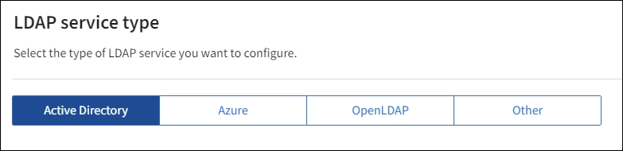

= 测试连接并保存配置
:allow-uri-read: 

. 选择*启用身份联合*。
. 在 LDAP 服务类型部分中，选择要配置的 LDAP 服务类型。
+

+
选择“*其他*”来配置使用 Oracle Directory Server 的 LDAP 服务器的值。

. 如果您选择了“*其他*”，请填写 LDAP 属性部分中的字段。否则，转到下一步。
+
** *用户唯一名称*：包含 LDAP 用户唯一标识符的属性名称。此属性相当于 `sAMAccountName`对于 Active Directory 和 `uid`对于 OpenLDAP。如果您正在配置 Oracle Directory Server，请输入 `uid`。
** *用户 UUID*：包含 LDAP 用户的永久唯一标识符的属性名称。此属性相当于 `objectGUID`对于 Active Directory 和 `entryUUID`对于 OpenLDAP。如果您正在配置 Oracle Directory Server，请输入 `nsuniqueid`。每个用户的指定属性值必须是 16 字节或字符串格式的 32 位十六进制数，其中连字符将被忽略。
** *组唯一名称*：包含 LDAP 组唯一标识符的属性的名称。此属性相当于 `sAMAccountName`对于 Active Directory 和 `cn`对于 OpenLDAP。如果您正在配置 Oracle Directory Server，请输入 `cn`。
** *组 UUID*：包含 LDAP 组的永久唯一标识符的属性的名称。此属性相当于 `objectGUID`对于 Active Directory 和 `entryUUID`对于 OpenLDAP。如果您正在配置 Oracle Directory Server，请输入 `nsuniqueid`。每个组的指定属性的值必须是 16 字节或字符串格式的 32 位十六进制数，其中连字符将被忽略。

. 对于所有 LDAP 服务类型，请在配置 LDAP 服务器部分输入所需的 LDAP 服务器和网络连接信息。
+
** *主机名*：LDAP 服务器的完全限定域名 (FQDN) 或 IP 地址。
** *端口*：用于连接 LDAP 服务器的端口。
+

NOTE: STARTTLS 的默认端口是 389，LDAPS 的默认端口是 636。但是，只要您的防火墙配置正确，您就可以使用任何端口。

** *用户名*：将连接到 LDAP 服务器的用户的专有名称 (DN) 的完整路径。
+
对于 Active Directory，您还可以指定下级登录名或用户主体名称。

+
指定的用户必须具有列出组和用户以及访问以下属性的权限：

+
*** `sAMAccountName`或者 `uid`
*** `objectGUID`， `entryUUID` ， 或者 `nsuniqueid`
*** `cn`
*** `memberOf`或者 `isMemberOf`
*** *活动目录*： `objectSid` ， `primaryGroupID` ， `userAccountControl` ， 和 `userPrincipalName`
*** *蔚蓝*： `accountEnabled`和 `userPrincipalName`

** *密码*：与用户名关联的密码。
+

NOTE: 如果您将来更改密码，则必须在此页面上更新。

** *组基础 DN*：您要搜索组的 LDAP 子树的可分辨名称 (DN) 的完整路径。在 Active Directory 示例（如下）中，所有可分辨名称相对于基本 DN（DC=storagegrid、DC=example、DC=com）的组都可以用作联合组。
+

NOTE: *组唯一名称*值在其所属的*组基本 DN*内必须是唯一的。

** *用户基础 DN*：您要搜索用户的 LDAP 子树的可分辨名称 (DN) 的完整路径。
+

NOTE: *用户唯一名称*值在其所属的*用户基本 DN*内必须是唯一的。

** *绑定用户名格式*（可选）：如果无法自动确定模式， StorageGRID应使用默认用户名模式。
+
建议提供*绑定用户名格式*，因为如果StorageGRID无法与服务帐户绑定，它可以允许用户登录。

+
输入以下模式之一：

+
*** *UserPrincipalName 模式（Active Directory 和 Azure）*： `[USERNAME]@_example_.com`
*** *下级登录名称模式（Active Directory 和 Azure）*： `_example_\[USERNAME]`
*** *可分辨名称模式*： `CN=[USERNAME],CN=Users,DC=_example_,DC=com`
+
完全按照书写方式包含 *[USERNAME]*。

. 在传输层安全性 (TLS) 部分中，选择一个安全设置。
+
** *使用 STARTTLS*：使用 STARTTLS 确保与 LDAP 服务器的通信安全。这是 Active Directory、OpenLDAP 或其他的推荐选项，但 Azure 不支持此选项。
** *使用 LDAPS*：LDAPS（通过 SSL 的 LDAP）选项使用 TLS 建立与 LDAP 服务器的连接。您必须为 Azure 选择此选项。
** *不要使用 TLS*： StorageGRID系统和 LDAP 服务器之间的网络流量将不安全。  Azure 不支持此选项。
+

NOTE: 如果您的 Active Directory 服务器强制执行 LDAP 签名，则不支持使用 *不使用 TLS* 选项。您必须使用 STARTTLS 或 LDAPS。

. 如果您选择了 STARTTLS 或 LDAPS，请选择用于保护连接的证书。
+
** *使用操作系统 CA 证书*：使用操作系统上安装的默认 Grid CA 证书来保护连接。
** *使用自定义 CA 证书*：使用自定义安全证书。
+
如果选择此设置，请将自定义安全证书复制并粘贴到 CA 证书文本框中。

=== 测试连接并保存配置

输入所有值后，必须先测试连接，然后才能保存配置。如果您提供了 LDAP 服务器的连接设置和绑定用户名格式， StorageGRID会验证该设置。

.步骤
. 选择*测试连接*。
. 如果您没有提供绑定用户名格式：
+
** 如果连接设置有效，则会出现“测试连接成功”消息。选择*保存*以保存配置。
** 如果连接设置无效，则会出现“无法建立测试连接”消息。选择*关闭*。然后，解决所有问题并再次测试连接。

. 如果您提供了绑定用户名格式，请输入有效联合用户的用户名和密码。
+
例如，输入您自己的用户名和密码。用户名中不要包含任何特殊字符，例如 @ 或 /。

+
image::../media/identity_federation_test_connection.png[身份联合提示验证绑定用户名格式]

+
** 如果连接设置有效，则会出现“测试连接成功”消息。选择*保存*以保存配置。
** 如果连接设置、绑定用户名格式或测试用户名和密码无效，则会出现错误消息。解决任何问题并再次测试连接。

