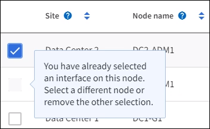

= 配置高可用性组
:allow-uri-read: 
:icons: font
:imagesdir: ../media/

[role="lead"]
您可以配置高可用性 (HA) 组以提供对管理节点或网关节点上的服务的高可用性访问。

.开始之前
* 您已使用link:../admin/web-browser-requirements.html["支持的网络浏览器"]。
* 你有link:admin-group-permissions.html["Root访问权限"]。
* 如果您计划在 HA 组中使用 VLAN 接口，则您已经创建了 VLAN 接口。看link:../admin/configure-vlan-interfaces.html["配置VLAN接口"] 。
* 如果您计划为 HA 组中的节点使用访问接口，则您已创建该接口：
+
** *Red Hat Enterprise Linux（安装节点之前）*：link:../rhel/creating-node-configuration-files.html["创建节点配置文件"]
** *Ubuntu 或 Debian（安装节点之前）*：link:../ubuntu/creating-node-configuration-files.html["创建节点配置文件"]
** *Linux（安装节点后）*：link:../maintain/linux-adding-trunk-or-access-interfaces-to-node.html["Linux：向节点添加主干或访问接口"]
** *VMware（安装节点后）*：link:../maintain/vmware-adding-trunk-or-access-interfaces-to-node.html["VMware：向节点添加中继或访问接口"]

== 创建高可用性组

创建高可用性组时，您可以选择一个或多个接口并按优先级顺序组织它们。然后，为该组分配一个或多个 VIP 地址。

接口必须用于网关节点或管理节点才能包含在 HA 组中。一个 HA 组只能为任何给定节点使用一个接口；但是，同一节点的其他接口可以在其他 HA 组中使用。

=== 访问向导

.步骤
. 选择 *配置* > *网络* > *高可用性组*。
. 选择“*创建*”。

=== 输入 HA 组的详细信息

.步骤
. 为 HA 组提供唯一的名称。
. 或者，输入 HA 组的描述。
. 选择*继续*。

=== 将接口添加到 HA 组

.步骤
. 选择一个或多个要添加到此 HA 组的接口。
+
使用列标题对行进行排序，或输入搜索词以更快地找到接口。

+
image::../media/ha_group_add_interfaces.png[HA 组添加接口]

+

NOTE: 创建 VLAN 接口后，最多等待 5 分钟，新接口就会出现在表中。

+
.选择接口的指南
** 您必须至少选择一个接口。
** 一个节点只能选择一个接口。
** 如果 HA 组用于管理节点服务（包括网格管理器和租户管理器）的 HA 保护，则仅选择管理节点上的接口。
** 如果 HA 组用于 S3 客户端流量的 HA 保护，请选择管理节点、网关节点或两者上的接口。
** 如果您选择不同类型节点上的接口，则会出现一条信息说明。需要提醒您的是，如果发生故障转移，先前活动节点提供的服务可能无法在新活动节点上使用。例如，备份网关节点无法为管理节点服务提供 HA 保护。同样，备份管理节点无法执行主管理节点可以提供的所有维护程序。
** 如果您无法选择接口，则其复选框将被禁用。工具提示提供了更多信息。
+

** 如果某个接口的子网值或网关与另一个选定的接口冲突，则您无法选择该接口。
** 如果配置的接口没有静态 IP 地址，则无法选择该接口。

. 选择*继续*。

=== 确定优先顺序

如果 HA 组包含多个接口，您可以确定哪个是主接口，哪些是备份（故障转移）接口。如果主接口出现故障，VIP 地址将移至可用的最高优先级接口。如果该接口出现故障，VIP 地址将移至下一个可用的最高优先级接口，依此类推。

.步骤
. 拖动“优先级顺序”列中的行来确定主接口和任何备份接口。
+
列表中的第一个接口是主接口。除非发生故障，否则主接口是活动接口。

+
image::../media/ha_group_determine_failover.png[HA 组确定优先级顺序]

+

TIP: 如果 HA 组提供对网格管理器的访问权限，则必须选择主管理节点上的一个接口作为主接口。某些维护程序只能从主管理节点执行。

. 选择*继续*。

=== 输入 IP 地址

.步骤
. 在 *Subnet CIDR* 字段中，以 CIDR 表示法指定 VIP 子网——IPv4 地址后跟斜杠和子网长度（0-32）。
+
网络地址不得设置任何主机位。例如，  `192.16.0.0/22` 。

+

NOTE: 如果使用32位前缀，VIP网络地址也充当网关地址和VIP地址。

+
image::../media/ha_group_select_virtual_ips.png[HA 团体进入 VIP]

. 或者，如果任何 S3 管理或租户客户端将从不同的子网访问这些 VIP 地址，请输入 *网关 IP 地址*。网关地址必须在 VIP 子网内。
+
客户端和管理员用户将使用此网关访问虚拟 IP 地址。

. 为 HA 组中的活动接口输入至少一个、最多十个 VIP 地址。所有 VIP 地址都必须位于 VIP 子网内，并且所有 VIP 地址都将在活动接口上同时处于活动状态。
+
您必须提供至少一个 IPv4 地址。您也可以选择指定其他 IPv4 和 IPv6 地址。

. 选择*创建 HA 组*并选择*完成*。
+
HA 组已创建，您现在可以使用配置的虚拟 IP 地址。

=== 后续步骤Next steps

如果您将使用此 HA 组进行负载平衡，请创建负载平衡器端点以确定端口和网络协议并附加任何所需的证书。看link:configuring-load-balancer-endpoints.html["配置负载均衡器端点"] 。

== 编辑高可用性组

您可以编辑高可用性 (HA) 组以更改其名称和描述、添加或删除接口、更改优先级顺序或添加或更新虚拟 IP 地址。

例如，如果您想在站点或节点退役过程中删除与选定接口关联的节点，则可能需要编辑 HA 组。

.步骤
. 选择 *配置* > *网络* > *高可用性组*。
+
高可用性组页面显示所有现有的 HA 组。

. 选中要编辑的 HA 组的复选框。
. 根据您要更新的内容执行以下操作之一：
+
** 选择*操作* > *编辑虚拟 IP 地址*来添加或删除 VIP 地址。
** 选择*操作* > *编辑 HA 组*来更新组的名称或描述、添加或删除接口、更改优先级顺序或添加或删除 VIP 地址。

. 如果您选择了“编辑虚拟 IP 地址”：
+
.. 更新 HA 组的虚拟 IP 地址。
.. 选择*保存*。
.. 选择*完成*。

. 如果您选择了“编辑 HA 组”：
+
.. 或者，更新群组的名称或描述。
.. 或者，选择或清除复选框来添加或删除接口。
+

NOTE: 如果 HA 组提供对网格管理器的访问权限，则必须选择主管理节点上的一个接口作为主接口。某些维护程序只能从主管理节点执行

.. 或者，拖动行来更改此 HA 组的主接口和任何备份接口的优先级顺序。
.. 或者，更新虚拟 IP 地址。
.. 选择*保存*，然后选择*完成*。

== 删除高可用性组

您可以一次删除一个或多个高可用性 (HA) 组。

TIP: 如果 HA 组绑定到负载均衡器端点，则无法删除它。要删除 HA 组，您必须将其从使用它的任何负载均衡器端点中删除。

为防止客户端中断，请在删除 HA 组之前更新任何受影响的 S3 客户端应用程序。更新每个客户端以使用另一个 IP 地址进行连接，例如，不同 HA 组的虚拟 IP 地址或在安装期间为接口配置的 IP 地址。

.步骤
. 选择 *配置* > *网络* > *高可用性组*。
. 检查要删除的每个 HA 组的 *负载均衡器端点* 列。如果列出了任何负载均衡器端点：
+
.. 转到 *配置* > *网络* > *负载均衡器端点*。
.. 选中端点的复选框。
.. 选择*操作* > *编辑端点绑定模式*。
.. 更新绑定模式以删除 HA 组。
.. 选择“保存更改”。

. 如果没有列出负载均衡器端点，请选中要删除的每个 HA 组的复选框。
. 选择*操作* > *删除 HA 组*。
. 查看消息并选择*删除 HA 组*以确认您的选择。
+
您选择的所有 HA 组都将被删除。高可用性组页面上会出现绿色的成功横幅。

