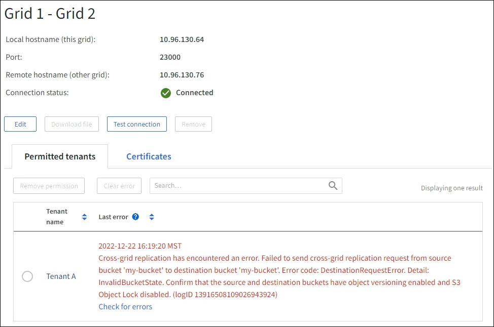

= 解决网格联合错误
:allow-uri-read: 
:icons: font
:imagesdir: ../media/

[role="lead"]
您可能需要排除与网格联合连接、帐户克隆和跨网格复制相关的警报和错误。

== [[grid-federation-errors]]电网联合连接警报和错误

您可能会收到警报或遇到电网联合连接错误。

进行任何更改以解决连接问题后，请测试连接以确保连接状态返回到*已连接*。有关说明，请参阅link:grid-federation-manage-connection.html["管理电网联合连接"]。

=== 电网联合连接失败警报

.问题描述
触发了“电网联合连接失败”警报。

.详细信息
此警报表示网格之间的网格联合连接不起作用。

.建议的操作
. 检查两个网格的网格联合页面上的设置。确认所有值均正确。看link:grid-federation-manage-connection.html["管理电网联合连接"] 。
. 检查用于连接的证书。确保没有关于网格联合证书过期的警报，并且每个证书的详细信息都是有效的。请参阅轮换连接证书的说明link:grid-federation-manage-connection.html["管理电网联合连接"]。
. 确认两个网格中的所有管理节点和网关节点均在线且可用。解决可能影响这些节点的任何警报并重试。
. 如果您为本地或远程网格提供了完全限定域名 (FQDN)，请确认 DNS 服务器在线且可用。看link:grid-federation-overview.html["什么是电网联合？"]满足网络、IP 地址和 DNS 要求。

=== 电网联合证书到期警报

.问题描述
触发了“电网联合证书过期”警报。

.详细信息
此警报表示一个或多个网格联合证书即将过期。

.建议的操作
请参阅轮换连接证书的说明link:grid-federation-manage-connection.html["管理电网联合连接"]。

=== 编辑电网联合连接时出错

.问题描述
编辑网格联合连接时，选择“保存并测试”时会看到以下警告消息：“无法在一个或多个节点上创建候选配置文件。”

.详细信息
当您编辑网格联合连接时， StorageGRID会尝试在第一个网格上的所有管理节点上保存“候选配置”文件。如果无法将此文件保存到所有管理节点（例如，由于管理节点处于离线状态），则会出现警告消息。

.建议的操作
. 从用于编辑连接的网格中，选择*NODES*。
. 确认该网格的所有管理节点均在线。
. 如果任何节点处于离线状态，请将其重新联机并尝试再次编辑连接。

== 帐户克隆错误

=== 无法登录克隆的租户帐户

.问题描述
您无法登录克隆的租户帐户。租户管理器登录页面上的错误消息是“此帐户的凭据无效。请重试。

.详细信息
出于安全原因，当租户帐户从租户的源网格克隆到租户的目标网格时，您为租户的本地 root 用户设置的密码不会被克隆。同样，当租户在其源网格上创建本地用户时，本地用户密码不会被克隆到目标网格。

.建议的操作
在 root 用户登录到租户的目标网格之前，网格管理员必须先link:changing-password-for-tenant-local-root-user.html["更改本地 root 用户的密码"]在目标网格上。

在克隆的本地用户可以登录到租户的目标网格之前，克隆租户的根用户必须在目标网格上为该用户添加密码。有关说明，请参阅link:../tenant/managing-local-users.html["管理本地用户"]在使用租户管理器的说明中。

=== 未使用克隆创建的租户

.问题描述
在使用 *使用网格联合连接* 权限创建新租户后，您会看到消息“创建租户时没有克隆”。

.详细信息
如果连接状态更新延迟，则可能会出现此问题，这可能会导致不健康的连接被列为*已连接*。

.建议的操作
. 查看错误消息中列出的原因并解决任何可能阻止连接工作的网络或其他问题。看<<grid-federation-errors,电网联合连接警报和错误>> 。
. 按照说明测试电网联合连接link:grid-federation-manage-connection.html["管理电网联合连接"]确认问题已得到解决。
. 从租户的源网格中，选择 *TENANTS*。
. 找到克隆失败的租户帐户。
. 选择租户名称以显示详细信息页面。
. 选择*重试帐户克隆*。
+
image::../media/grid-federation-retry-account-clone.png[显示错误消息和“重试帐户克隆”按钮的屏幕截图]

+
如果错误已解决，租户帐户现在将被克隆到另一个网格。

== 跨网格复制警报和错误

=== 连接或租户显示的最后一个错误

.问题描述
什么时候link:../monitor/grid-federation-monitor-connections.html["查看电网联合连接"]（或当link:grid-federation-manage-tenants.html["管理获准租户"]对于连接），您会注意到连接详细信息页面上的“最后错误”列中有一个错误。例如：

.详细信息
对于每个网格联合连接，*最后一个错误*列显示租户数据复制到另一个网格时发生的最近错误（如果有）。此列仅显示最后发生的跨网格复制错误；之前可能发生的错误将不会显示。此列中的错误可能由于以下原因之一而发生：

* 未找到源对象版本。
* 未找到源存储桶。
* 目标存储桶已被删除。
* 目标存储桶已由其他帐户重新创建。
* 目标存储桶已暂停版本控制。
* 目标存储桶由同一帐户重新创建，但现在尚未版本控制。

.建议的操作
如果“*上次错误*”列中出现错误消息，请按照以下步骤操作：

. 查看消息文本。
. 执行任何建议的操作。例如，如果在目标存储桶上暂停跨网格复制的版本控制，则重新启用该存储桶的版本控制。
. 从表中选择连接或租户帐户。
. 选择*清除错误*。
. 选择“是”清除该消息并更新系统状态。
. 等待 5-6 分钟，然后将新对象放入存储桶中。确认错误消息不再出现。
+

NOTE: 为确保清除错误消息，请在消息中的时间戳之后至少等待 5 分钟，然后再提取新对象。

+

TIP: 清除错误后，如果将对象提取到同样存在错误的不同存储桶中，则可能会出现新的*最后错误*。

. 要确定是否有任何对象由于存储桶错误而复制失败，请参阅link:../admin/grid-federation-retry-failed-replication.html["识别并重试失败的复制操作"]。

=== 跨网格复制永久故障警报

.问题描述
触发了“跨网格复制永久失败”警报。

.详细信息
此警报表示由于需要用户干预才能解决的原因，租户对象无法在两个网格上的存储桶之间复制。此警报通常是由源存储桶或目标存储桶的更改引起的。

.建议的操作
. Sign in到触发警报的网格。
. 转到 *配置* > *系统* > *网格联合*，然后找到警报中列出的连接名称。
. 在“允许的租户”选项卡上，查看“*最后一个错误*”列以确定哪些租户帐户有错误。
. 要了解有关失败的更多信息，请参阅link:../monitor/grid-federation-monitor-connections.html["监控电网联合连接"]查看跨网格复制指标。
. 对于每个受影响的租户帐户：
+
.. 请参阅link:../monitor/monitoring-tenant-activity.html["监控租户活动"]确认租户在目标网格上没有超出其跨网格复制的配额。
.. 根据需要，增加目标网格上的租户配额以允许保存新对象。

. 对于每个受影响的租户，登录两个网格上的租户管理器，以便您可以比较存储桶列表。
. 对于每个启用了跨网格复制的存储桶，请确认以下内容：
+
** 另一个网格上有一个针对同一租户的对应存储桶（必须使用完全相同的名称）。
** 两个存储桶都启用了对象版本控制（任一网格上都不能暂停版本控制）。
** 两个存储桶均已禁用 S3 对象锁。
** 两个存储桶均未处于*删除对象：只读*状态。

. 要确认问题是否已解决，请参阅link:../monitor/grid-federation-monitor-connections.html["监控电网联合连接"]查看跨网格复制指标，或执行以下步骤：
+
.. 返回网格联合页面。
.. 选择受影响的租户，然后在*最后一个错误*列中选择*清除错误*。
.. 选择“是”清除该消息并更新系统状态。
.. 等待 5-6 分钟，然后将新对象放入存储桶中。确认错误消息不再出现。
+

NOTE: 为确保清除错误消息，请在消息中的时间戳之后至少等待 5 分钟，然后再提取新对象。

+

NOTE: 警报解决后可能需要一天的时间才能清除。

.. 前往link:grid-federation-retry-failed-replication.html["识别并重试失败的复制操作"]识别任何对象或删除无法复制到另一个网格的标记，并根据需要重试复制。

=== 跨网格复制资源不可用警报

.问题描述
触发了“*跨网格复制资源不可用*”警报。

.详细信息
此警报表示由于资源不可用，跨网格复制请求处于待处理状态。例如，可能存在网络错误。

.建议的操作
. 监视警报以查看问题是否自行解决。
. 如果问题仍然存在，请确定任一网格是否对同一连接有*网格联合连接失败*警报或对某个节点有*无法与节点通信*警报。当您解决这些警报时，此警报可能会得到解决。
. 要了解有关失败的更多信息，请参阅link:../monitor/grid-federation-monitor-connections.html["监控电网联合连接"]查看跨网格复制指标。
. 如果您无法解决警报，请联系技术支持。

问题解决后，跨网格复制将正常进行。
