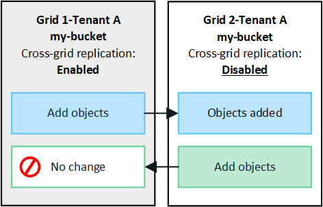

= 什么是跨网格复制？
:allow-uri-read: 
:icons: font
:imagesdir: ../media/

[role="lead"]
跨网格复制是指在两个StorageGRID系统中选定的 S3 存储桶之间自动复制对象，这两个系统以link:grid-federation-overview.html["电网联合连接"]。link:grid-federation-what-is-account-clone.html["账户克隆"]是跨网格复制所必需的。

== 跨网格复制的工作流程

工作流程图总结了在两个网格上的存储桶之间配置跨网格复制的步骤。

image::../media/grid-federation-cgr-workflow.png[跨网格复制工作流程]

== 跨网格复制的要求

如果租户帐户具有使用网格联合连接权限，可以使用一个或多个link:grid-federation-overview.html["电网联合连接"]，具有 Root 访问权限的租户用户可以在每个网格上相应的租户账户中创建相同的 bucket。这些存储桶：

* 必须具有相同的名称，但可以有不同的区域
* 必须启用版本控制
* 必须禁用 S3 对象锁
* 必须为空

创建两个存储桶后，可以为其中一个或两个存储桶配置跨网格复制。

.了解更多
link:../tenant/grid-federation-manage-cross-grid-replication.html["管理跨网格复制"]

== 跨网格复制的工作原理

跨网格复制可以配置为单向或双向进行。

=== 单向复制

如果仅为一个网格上的存储桶启用跨网格复制，则添加到该存储桶（源存储桶）的对象将被复制到另一个网格上的相应存储桶（目标存储桶）。但是，添加到目标存储桶的对象不会被复制回源。图中，启用了跨网格复制 `my-bucket`从网格 1 到网格 2，但在另一个方向未启用。

=== 双向复制

如果在两个网格上为同一个存储桶启用跨网格复制，则添加到任一存储桶的对象都会复制到另一个网格。图中，启用了跨网格复制 `my-bucket`在两个方向上。

image::../media/grid-federation-cross-grid-replication.png[该图显示了单向复制与双向复制的对比]

=== 当物体被吞食时会发生什么？

当 S3 客户端将对象添加到启用了跨网格复制的存储桶时，会发生以下情况：

. StorageGRID自动将对象从源存储桶复制到目标存储桶。执行此后台复制操作的时间取决于几个因素，包括待处理的其他复制操作的数量。
+
S3 客户端可以通过发出 GetObject 或 HeadObject 请求来验证对象的复制状态。响应包括StorageGRID特定的 `x-ntap-sg-cgr-replication-status`响应标头，它将具有以下值之一：S3 客户端可以通过发出 GetObject 或 HeadObject 请求来验证对象的复制状态。响应包括StorageGRID特定的 `x-ntap-sg-cgr-replication-status`响应标头，它将具有以下值之一：

+
[cols="1a,2a"]
|===
| Grid | 复制状态 

 a| 
源
 a| 
** *已完成*：所有电网连接的复制均已成功。
** *待定*：对象尚未复制到至少一个电网连接。
** *失败*：任何电网连接均未挂起复制，并且至少有一个电网连接发生永久性故障。用户必须解决该错误。

 a| 
目标
 a| 
*REPLICA*：对象已从源网格复制。

|===
+

NOTE: StorageGRID不支持 `x-amz-replication-status`标头。

. StorageGRID使用每个网格的活动 ILM 策略来管理对象，就像管理任何其他对象一样。例如，网格 1 上的对象 A 可能存储为两个副本并永久保留，而复制到网格 2 的对象 A 的副本可能使用 2+1 擦除编码存储并在三年后删除。

=== 当对象被删除时会发生什么？

正如所述link:../primer/delete-data-flow.html["删除数据流"]， StorageGRID可能会因以下任何原因删除对象：

* S3客户端发出删除请求。
* 租户管理器用户选择link:../tenant/deleting-s3-bucket-objects.html["删除存储桶中的对象"]从存储桶中删除所有对象的选项。
* bucket有一个生命周期配置，它会过期。
* 对象的 ILM 规则中的最后一个时间段结束，并且没有指定进一步的放置位置。

当StorageGRID由于删除存储桶操作中的对象、存储桶生命周期到期或 ILM 放置到期而删除对象时，复制的对象永远不会从网格联合连接中的另一个网格中删除。但是，S3 客户端删除添加到源存储桶的删除标记可以选择复制到目标存储桶。

要了解当 S3 客户端从启用了跨网格复制的存储桶中删除对象时会发生什么，请查看 S3 客户端如何从启用了版本控制的存储桶中删除对象，如下所示：

* 如果 S3 客户端发出包含版本 ID 的删除请求，则该版本的对象将被永久删除。未向存储桶添加删除标记。
* 如果 S3 客户端发出不包含版本 ID 的删除请求， StorageGRID不会删除任何对象版本。相反，它会向存储桶添加一个删除标记。删除标记使StorageGRID表现得好像对象已被删除：
+
** 没有版本 ID 的 GetObject 请求将失败，并显示 `404 No Object Found`
** 具有有效版本 ID 的 GetObject 请求将会成功并返回请求的对象版本。

当 S3 客户端从启用了跨网格复制的存储桶中删除对象时， StorageGRID会确定是否将删除请求复制到目标，如下所示：

* 如果删除请求包含版本 ID，则该对象版本将从源网格中永久删除。但是， StorageGRID不会复制包含版本 ID 的删除请求，因此不会从目标中删除相同的对象版本。
* 如果删除请求不包含版本 ID， StorageGRID可以根据存储桶的跨网格复制配置方式选择性地复制删除标记：
+
** 如果您选择复制删除标记（默认），则删除标记将添加到源存储桶并复制到目标存储桶。实际上，该对象似乎在两个网格上都被删除了。
** 如果您选择不复制删除标记，则删除标记将添加到源存储桶，但不会复制到目标存储桶。实际上，在源网格上删除的对象不会在目标网格上删除。

在图中，当link:../tenant/grid-federation-manage-cross-grid-replication.html["跨网格复制已启用"]。包含版本 ID 的源存储桶的删除请求不会从目标存储桶中删除对象。不包含版本 ID 的源存储桶的删除请求将显示为删除目标存储桶中的对象。

image::../media/grid-federation-cross-grid-replication-delete.png[该图显示了两个网格上的复制客户端删除]

NOTE: 如果要保持网格之间的对象删除同步，请创建相应的link:../s3/create-s3-lifecycle-configuration.html["S3 生命周期配置"]对于两个网格上的桶。

=== 如何复制加密对象

当您使用跨网格复制在网格之间复制对象时，您可以加密单个对象、使用默认存储桶加密或配置网格范围加密。您可以在为存储桶启用跨网格复制之前或之后添加、修改或删除默认存储桶或网格范围的加密设置。

要加密单个对象，您可以在将对象添加到源存储桶时使用 SSE（使用StorageGRID管理密钥的服务器端加密）。使用 `x-amz-server-side-encryption`请求标头并指定 `AES256`。看link:../s3/using-server-side-encryption.html["使用服务器端加密"] 。

NOTE: 跨网格复制不支持使用 SSE-C（使用客户提供的密钥的服务器端加密）。摄取操作将会失败。

要对存储桶使用默认加密，请使用 PutBucketEncryption 请求并设置 `SSEAlgorithm`参数 `AES256`。存储桶级加密适用于未经 `x-amz-server-side-encryption`请求标头。看link:../s3/operations-on-buckets.html["对 bucket 的操作"] 。

要使用网格级加密，请将*存储对象加密*选项设置为*AES-256*。网格级加密适用于未在存储桶级别加密的任何对象，或未经 `x-amz-server-side-encryption`请求标头。看link:../admin/changing-network-options-object-encryption.html["配置网络和对象选项"] 。

NOTE: SSE 不支持 AES-128。如果使用 *AES-128* 选项为源网格启用了 *存储对象加密* 选项，则 AES-128 算法的使用将不会传播到复制的对象。相反，复制的对象将使用目标的默认存储桶或网格级加密设置（如果可用）。

在确定如何加密源对象时， StorageGRID应用以下规则：

. 使用 `x-amz-server-side-encryption`摄取标头（如果存在）。
. 如果不存在摄取标头，则使用存储桶默认加密设置（如果已配置）。
. 如果未配置存储桶设置，则使用网格范围的加密设置（如果已配置）。
. 如果不存在网格范围的设置，则不要加密源对象。

在确定如何加密复制对象时， StorageGRID按以下顺序应用这些规则：

. 使用与源对象相同的加密，除非该对象使用 AES-128 加密。
. 如果源对象未加密或使用 AES-128，则使用目标存储桶的默认加密设置（如果已配置）。
. 如果目标存储桶没有加密设置，则使用目标的网格范围加密设置（如果已配置）。
. 如果不存在网格范围的设置，则不要加密目标对象。

=== 不支持 PutObjectTagging 和 DeleteObjectTagging

对于已启用跨网格复制的存储桶中的对象，不支持 PutObjectTagging 和 DeleteObjectTagging 请求。

如果 S3 客户端发出 PutObjectTagging 或 DeleteObjectTagging 请求， `501 Not Implemented`被退回。消息是 `Put(Delete) ObjectTagging is not available for buckets that have cross-grid replication configured`。

=== 如何复制分段对象

源网格的最大段大小适用于复制到目标网格的对象。当对象被复制到另一个网格时，源网格的*最大段大小*设置（*配置*>*系统*>*存储选项*）将在两个网格上使用。例如，假设源网格的最大段大小为 1 GB，而目标网格的最大段大小为 50 MB。如果您在源网格上提取一个 2 GB 的对象，则该对象将保存为两个 1 GB 的段。它还将作为两个 1 GB 的段复制到目标网格，即使该网格的最大段大小为 50 MB。
