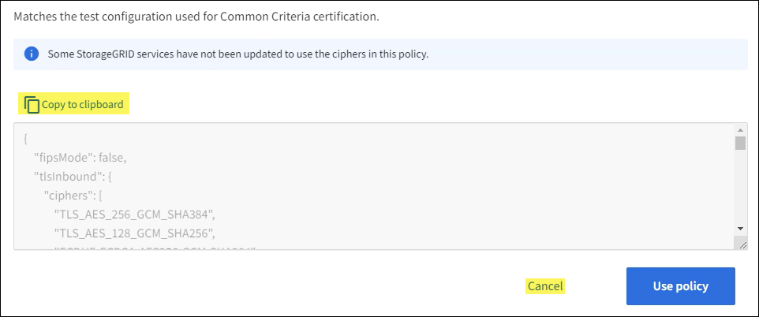

= 管理 TLS 和 SSH 策略
:allow-uri-read: 
:icons: font
:imagesdir: ../media/

[role="lead"]
TLS 和 SSH 策略决定使用哪些协议和密码与客户端应用程序建立安全的 TLS 连接以及与内部StorageGRID服务建立安全的 SSH 连接。

安全策略控制 TLS 和 SSH 如何加密传输中的数据。一般来说，使用现代兼容性（默认）策略，除非您的系统需要符合通用标准或您需要使用其他密码。

NOTE: 某些StorageGRID服务尚未更新以使用这些策略中的密码。

.开始之前
* 您已使用link:../admin/web-browser-requirements.html["支持的网络浏览器"]。
* 你有link:admin-group-permissions.html["Root访问权限"]。

== 选择安全策略

.步骤
. 选择*配置* > *安全* > *安全设置*。
+
*TLS 和 SSH 策略*选项卡显示可用的策略。当前有效的策略在策略图块上以绿色复选标记表示。

+
image::../media/securitysettings_tls_ssh_policies_current.png[TLS 和 SSH 策略]

. 查看图块以了解可用的策略。
+
[cols="1a,2a"]
|===
| 策略 | 描述 

 a| 
现代兼容性（默认）
 a| 
如果您需要强加密并且除非您有特殊要求，请使用默认策略。此策略与大多数 TLS 和 SSH 客户端兼容。

 a| 
旧版兼容性
 a| 
如果您需要为旧客户端提供额外的兼容性选项，请使用此策略。此策略中的附加选项可能会使其安全性低于现代兼容性策略。

 a| 
通用标准
 a| 
如果您需要通用标准认证，请使用此政策。

 a| 
FIPS 严格
 a| 
如果您需要通用标准认证并且需要使用NetApp加密安全模块 3.0.8 将外部客户端连接到负载平衡器端点、租户管理器和网格管理器，请使用此策略。使用此策略可能会降低性能。

*注意*：选择此策略后，所有节点都必须link:../maintain/rolling-reboot-procedure.html["以滚动方式重启"]激活NetApp加密安全模块。使用*维护* > *滚动重启*来启动和监控重启。

 a| 
自定义
 a| 
如果您需要应用自己的密码，请创建自定义策略。

|===
. 要查看有关每个策略的密码、协议和算法的详细信息，请选择*查看详细信息*。
. 要更改当前策略，请选择*使用策略*。
+
政策图块上的“当前政策”旁边会出现一个绿色复选标记。

== 创建自定义安全策略

如果您需要应用自己的密码，您可以创建自定义策略。

.步骤
. 从与您要创建的自定义策略最相似的策略的图块中，选择“查看详细信息”。
. 选择*复制到剪贴板*，然后选择*取消*。
+

. 从*自定义策略*图块中，选择*配置和使用*。
. 粘贴您复制的 JSON 并进行所需的更改。
. 选择*使用策略*。
+
自定义策略图块上的“*当前策略*”旁边会出现一个绿色复选标记。

. 或者，选择“*编辑配置*”对新的自定义策略进行更多更改。

== 暂时恢复默认安全策略

如果您配置了自定义安全策略，并且配置的 TLS 策略与link:global-certificate-types.html["配置服务器证书"]。

您可以暂时恢复默认安全策略。

.步骤
. 登录管理节点：
+
.. 输入以下命令： `ssh admin@_Admin_Node_IP_`
.. 输入 `Passwords.txt`文件。
.. 输入以下命令切换到root： `su -`
.. 输入 `Passwords.txt`文件。
+
当您以 root 身份登录时，提示符将从 `$`到 `#`。

. 运行以下命令：
+
`restore-default-cipher-configurations`

. 从 Web 浏览器访问同一管理节点上的网格管理器。
. 按照以下步骤操作<<select-a-security-policy,选择安全策略>>重新配置策略。

