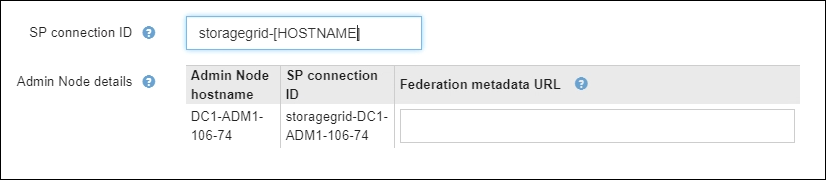

= 使用沙盒模式
:allow-uri-read: 
:icons: font
:imagesdir: ../media/

[role="lead"]
您可以使用沙盒模式来配置和测试单点登录 (SSO)，然后为所有StorageGRID用户启用它。启用 SSO 后，您可以在需要更改或重新测试配置时返回沙盒模式。

.开始之前
* 您已使用link:../admin/web-browser-requirements.html["支持的网络浏览器"]。
* 你有link:admin-group-permissions.html["Root访问权限"]。
* 您已为StorageGRID系统配置身份联合。
* 对于身份联合 *LDAP 服务类型*，您可以根据计划使用的 SSO 身份提供程序选择 Active Directory 或 Azure。
+
[cols="1a,1a"]
|===
| 配置的 LDAP 服务类型 | SSO 身份提供者的选项 

 a| 
Active Directory
 a| 
** Active Directory
** Azure
** Ping联邦

 a| 
Azure
 a| 
Azure

|===

.关于此任务
当启用 SSO 并且用户尝试登录管理节点时， StorageGRID会向 SSO 身份提供商发送身份验证请求。反过来，SSO 身份提供者将身份验证响应发送回StorageGRID，指示身份验证请求是否成功。对于成功的请求：

* Active Directory 或 PingFederate 的响应包括用户的通用唯一标识符 (UUID)。
* Azure 的响应包括用户主体名称 (UPN)。

为了允许StorageGRID （服务提供商）和 SSO 身份提供商就用户身份验证请求进行安全通信，您必须在StorageGRID中配置某些设置。接下来，您必须使用 SSO 身份提供商的软件为每个管理节点创建信赖方信任 (AD FS)、企业应用程序 (Azure) 或服务提供商 (PingFederate)。最后，您必须返回StorageGRID以启用 SSO。

沙盒模式可以轻松执行这种来回配置，并在启用 SSO 之前测试所有设置。当您使用沙盒模式时，用户无法使用 SSO 登录。

== 访问沙盒模式

.步骤
. 选择*配置* > *访问控制* > *单点登录*。
+
出现“单点登录”页面，其中选择了“*已禁用*”选项。

+
image::../media/sso_status_disabled.png[已禁用 SSO 状态的单点登录页面]

+

NOTE: 如果未出现 SSO 状态选项，请确认您已将身份提供者配置为联合身份源。看link:requirements-for-sso.html["单点登录的要求和注意事项"] 。

. 选择*沙盒模式*。
+
出现身份提供者部分。

== 输入身份提供者详细信息

.步骤
. 从下拉列表中选择 *SSO 类型*。
. 根据您选择的 SSO 类型填写身份提供者部分中的字段。
+
[role="tabbed-block"]
====
.Active Directory
--
.. 输入身份提供者的*联合身份验证服务名称*，与其在 Active Directory 联合身份验证服务 (AD FS) 中显示的名称完全一致。
+

NOTE: 要找到联合服务名称，请转到 Windows 服务器管理器。选择“工具”>“AD FS 管理”。从操作菜单中，选择*编辑联合服务属性*。联合服务名称显示在第二个字段中。

.. 指定当身份提供者响应StorageGRID请求发送 SSO 配置信息时将使用哪个 TLS 证书来保护连接。
+
*** *使用操作系统 CA 证书*：使用操作系统上安装的默认 CA 证书来保护连接。
*** *使用自定义 CA 证书*：使用自定义 CA 证书来保护连接。
+
如果选择此设置，请复制自定义证书的文本并将其粘贴到 *CA 证书* 文本框中。

*** *不要使用 TLS*：不要使用 TLS 证书来保护连接。
+

CAUTION: 如果您更改了 CA 证书，请立即link:../maintain/starting-or-restarting-service.html["在管理节点上重新启动 mgmt-api 服务"]并测试是否成功 SSO 进入网格管理器。

.. 在“依赖方”部分中，指定StorageGRID的“依赖方标识符”。此值控制您在 AD FS 中为每个信赖方信任所使用的名称。
+
*** 例如，如果您的网格只有一个管理节点，并且您不打算在将来添加更多管理节点，请输入 `SG`或者 `StorageGRID`。
*** 如果您的网格包含多个管理节点，请包含字符串 `[HOSTNAME]`在标识符中。例如，  `SG-[HOSTNAME]` 。这将生成一个表，根据节点的主机名显示系统中每个管理节点的依赖方标识符。
+
image::../media/sso_status_sandbox_mode_active_directory.png[单点登录,Sandbox mode enabled,Relying party identifiers shown for several Admin Nodes]

+

NOTE: 您必须为StorageGRID系统中的每个管理节点创建一个依赖方信任。每个管理节点都拥有依赖方信任，确保用户可以安全地登录和退出任何管理节点。

.. 选择*保存*。
+
*保存*按钮上会出现绿色复选标记，持续几秒钟。

+
image::../media/save_button_green_checkmark.gif[带有绿色复选标记的“保存”按钮]

--
.Azure
--
.. 指定当身份提供者响应StorageGRID请求发送 SSO 配置信息时将使用哪个 TLS 证书来保护连接。
+
*** *使用操作系统 CA 证书*：使用操作系统上安装的默认 CA 证书来保护连接。
*** *使用自定义 CA 证书*：使用自定义 CA 证书来保护连接。
+
如果选择此设置，请复制自定义证书的文本并将其粘贴到 *CA 证书* 文本框中。

*** *不要使用 TLS*：不要使用 TLS 证书来保护连接。
+

CAUTION: 如果您更改了 CA 证书，请立即link:../maintain/starting-or-restarting-service.html["在管理节点上重新启动 mgmt-api 服务"]并测试是否成功 SSO 进入网格管理器。

.. 在企业应用程序部分，指定StorageGRID的 *企业应用程序名称*。此值控制您在 Azure AD 中为每个企业应用程序使用的名称。
+
*** 例如，如果您的网格只有一个管理节点，并且您不打算在将来添加更多管理节点，请输入 `SG`或者 `StorageGRID`。
*** 如果您的网格包含多个管理节点，请包含字符串 `[HOSTNAME]`在标识符中。例如，  `SG-[HOSTNAME]` 。这将生成一个表，根据节点的主机名显示系统中每个管理节点的企业应用程序名称。
+
image::../media/sso_status_sandbox_mode_azure.png[单点登录,Sandbox mode enabled,Relying party identifiers shown for several Admin Nodes]

+

NOTE: 您必须为StorageGRID系统中的每个管理节点创建一个企业应用程序。每个管理节点都有一个企业应用程序，可确保用户可以安全地登录和退出任何管理节点。

.. 按照以下步骤操作link:../admin/creating-enterprise-application-azure.html["在 Azure AD 中创建企业应用程序"]为表中列出的每个管理节点创建一个企业应用程序。
.. 从 Azure AD 复制每个企业应用程序的联合元数据 URL。然后，将此 URL 粘贴到StorageGRID中相应的 *Federation metadata URL* 字段中。
.. 复制并粘贴所有管理节点的联合元数据 URL 后，选择 *保存*。
+
*保存*按钮上会出现绿色复选标记，持续几秒钟。

+
image::../media/save_button_green_checkmark.gif[带有绿色复选标记的“保存”按钮]

--
.Ping联邦
--
.. 指定当身份提供者响应StorageGRID请求发送 SSO 配置信息时将使用哪个 TLS 证书来保护连接。
+
*** *使用操作系统 CA 证书*：使用操作系统上安装的默认 CA 证书来保护连接。
*** *使用自定义 CA 证书*：使用自定义 CA 证书来保护连接。
+
如果选择此设置，请复制自定义证书的文本并将其粘贴到 *CA 证书* 文本框中。

*** *不要使用 TLS*：不要使用 TLS 证书来保护连接。
+

CAUTION: 如果您更改了 CA 证书，请立即link:../maintain/starting-or-restarting-service.html["在管理节点上重新启动 mgmt-api 服务"]并测试是否成功 SSO 进入网格管理器。

.. 在服务提供商 (SP ) 部分中，指定StorageGRID的 * SP连接 ID *。此值控制您在 PingFederate 中为每个SP连接使用的名称。
+
*** 例如，如果您的网格只有一个管理节点，并且您不打算在将来添加更多管理节点，请输入 `SG`或者 `StorageGRID`。
*** 如果您的网格包含多个管理节点，请包含字符串 `[HOSTNAME]`在标识符中。例如，  `SG-[HOSTNAME]` 。这将生成一个表，根据节点的主机名显示系统中每个管理节点的SP连接 ID。
+

+

NOTE: 您必须为StorageGRID系统中的每个管理节点创建一个SP连接。每个管理节点都有一个SP连接，可确保用户可以安全地登录和退出任何管理节点。

.. 在 *Federation metadata URL* 字段中指定每个管理节点的联合元数据 URL。
+
使用以下格式：

+
[listing]
----
https://<Federation Service Name>:<port>/pf/federation_metadata.ping?PartnerSpId=<SP Connection ID>
----
.. 选择*保存*。
+
*保存*按钮上会出现绿色复选标记，持续几秒钟。

+
image::../media/save_button_green_checkmark.gif[带有绿色复选标记的“保存”按钮]

--
====

== 配置信赖方信任、企业应用程序或SP连接

保存配置后，会出现沙盒模式确认通知。此通知确认沙盒模式现已启用并提供概述说明。

StorageGRID可以根据需要保持沙盒模式。但是，当在单点登录页面上选择“沙盒模式”时，所有StorageGRID用户的 SSO 都将被禁用。只有本地用户可以登录。

按照以下步骤配置信赖方信任（Active Directory）、完成企业应用程序（Azure）或配置SP连接（PingFederate）。

[role="tabbed-block"]
====
.Active Directory
--
.步骤
. 转到 Active Directory 联合身份验证服务 (AD FS)。
. 使用StorageGRID单点登录页面上的表格中显示的每个依赖方标识符，为StorageGRID创建一个或多个依赖方信任。
+
您必须为表中显示的每个管理节点创建一个信任。

+
有关说明，请访问link:../admin/creating-relying-party-trusts-in-ad-fs.html["在 AD FS 中创建信赖方信任"]。

--
.Azure
--
.步骤
. 从您当前登录的管理节点的单点登录页面，选择按钮下载并保存 SAML 元数据。
. 然后，对于网格中的任何其他管理节点，重复以下步骤：
+
.. Sign in到节点。
.. 选择*配置* > *访问控制* > *单点登录*。
.. 下载并保存该节点的 SAML 元数据。

. 转到 Azure 门户。
. 按照以下步骤操作link:../admin/creating-enterprise-application-azure.html["在 Azure AD 中创建企业应用程序"]将每个管理节点的 SAML 元数据文件上传到其对应的 Azure 企业应用程序中。

--
.Ping联邦
--
.步骤
. 从您当前登录的管理节点的单点登录页面，选择按钮下载并保存 SAML 元数据。
. 然后，对于网格中的任何其他管理节点，重复以下步骤：
+
.. Sign in到节点。
.. 选择*配置* > *访问控制* > *单点登录*。
.. 下载并保存该节点的 SAML 元数据。

. 转到 PingFederate。
. link:../admin/creating-sp-connection-ping.html["为StorageGRID创建一个或多个服务提供商 ( SP ) 连接"] 。使用每个管理节点的SP连接 ID（显示在StorageGRID单点登录页面上的表格中）以及为该管理节点下载的 SAML 元数据。
+
您必须为表中显示的每个管理节点创建一个SP连接。

--
====

== 测试 SSO 连接

在强制整个StorageGRID系统使用单点登录之前，您应该确认每个管理节点的单点登录和单点注销都正确配置。

[role="tabbed-block"]
====
.Active Directory
--
.步骤
. 在StorageGRID单点登录页面中，找到沙盒模式消息中的链接。
+
该 URL 源自您在 *联合服务名称* 字段中输入的值。

+
image::../media/sso_sandbox_mode_url.gif[身份提供商登录页面的 URL]

. 选择链接或将 URL 复制并粘贴到浏览器中，以访问您的身份提供商的登录页面。
. 要确认您可以使用 SSO 登录StorageGRID，请选择 *Sign in到以下站点之一*，选择主管理节点的信赖方标识符，然后选择 *Sign in*。
+
image::../media/sso_sandbox_mode_testing.gif[在 SSO 沙盒模式下测试依赖方信任]

. 输入您的联合用户名和密码。
+
** 如果 SSO 登录和注销操作成功，则会显示成功消息。
+
image::../media/sso_sandbox_mode_sign_in_success.gif[SSO认证和注销测试成功消息]

** 如果 SSO 操作不成功，则会显示一条错误消息。解决问题，清除浏览器的 cookie，然后重试。

. 重复这些步骤来验证网格中每个管理节点的 SSO 连接。

--
.Azure
--
.步骤
. 转到 Azure 门户中的单一登录页面。
. 选择*测试此应用程序*。
. 输入联合用户的凭据。
+
** 如果 SSO 登录和注销操作成功，则会显示成功消息。
+
image::../media/sso_sandbox_mode_sign_in_success.gif[SSO认证和注销测试成功消息]

** 如果 SSO 操作不成功，则会显示一条错误消息。解决问题，清除浏览器的 cookie，然后重试。

. 重复这些步骤来验证网格中每个管理节点的 SSO 连接。

--
.Ping联邦
--
.步骤
. 从StorageGRID单点登录页面，选择沙盒模式消息中的第一个链接。
+
一次选择并测试一个链接。

+
image::../media/sso_sandbox_mode_enabled_ping.png[单点登录]

. 输入联合用户的凭据。
+
** 如果 SSO 登录和注销操作成功，则会显示成功消息。
+
image::../media/sso_sandbox_mode_sign_in_success.gif[SSO认证和注销测试成功消息]

** 如果 SSO 操作不成功，则会显示一条错误消息。解决问题，清除浏览器的 cookie，然后重试。

. 选择下一个链接来验证网格中每个管理节点的 SSO 连接。
+
如果您看到“页面已过期”消息，请选择浏览器中的“*返回*”按钮并重新提交您的凭据。

--
====

== 启用单点登录

当您确认可以使用 SSO 登录到每个管理节点后，您可以为整个StorageGRID系统启用 SSO。

TIP: 启用 SSO 后，所有用户都必须使用 SSO 来访问网格管理器、租户管理器、网格管理 API 和租户管理 API。本地用户无法再访问StorageGRID。

.步骤
. 选择*配置* > *访问控制* > *单点登录*。
. 将 SSO 状态更改为 *已启用*。
. 选择*保存*。
. 查看警告消息，然后选择“*确定*”。
+
单点登录现已启用。

TIP: 如果您使用 Azure 门户并从用于访问 Azure 的同一台计算机访问StorageGRID ，请确保 Azure 门户用户也是授权的StorageGRID用户（已导入StorageGRID 的联合组中的用户）或在尝试登录StorageGRID之前注销 Azure 门户。
