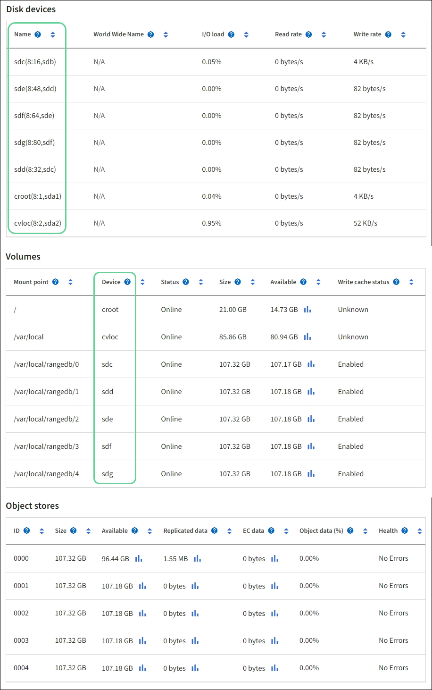

= 将存储卷添加到存储节点
:allow-uri-read: 
:icons: font
:imagesdir: ../media/

[role="lead"]
您可以扩展低于最大支持卷数的存储节点的存储容量。您可能需要将存储卷添加到多个存储节点以满足复制或擦除编码副本的 ILM 要求。

.开始之前
在添加存储卷之前，请查看link:guidelines-for-adding-object-capacity.html["添加对象容量的指南"]确保您知道在哪里添加卷以满足 ILM 策略的要求。

NOTE: 这些说明仅适用于基于软件的存储节点。看 https://docs.netapp.com/us-en/storagegrid-appliances/sg6000/adding-expansion-shelf-to-deployed-sg6060.html["为已部署的 SG6060 添加扩展架"^]或者 https://docs.netapp.com/us-en/storagegrid-appliances/sg6100/adding-expansion-shelf-to-deployed-sg6160.html["为已部署的 SG6160 添加扩展架"^]了解如何通过安装扩展架向 SG6060 或 SG6160 添加存储卷。其他设备存储节点无法扩展。

.关于此任务
存储节点的底层存储分为存储卷。存储卷是基于块的存储设备，由StorageGRID系统格式化并安装以存储对象。每个存储节点最多可支持 48 个存储卷，在网格管理器中称为_对象存储_。

NOTE: 对象元数据始终存储在对象存储 0 中。

每个对象存储都安装在与其 ID 对应的卷上。例如，ID 为 0000 的对象存储对应于 `/var/local/rangedb/0`挂载点。

在添加新的存储卷之前，使用网格管理器查看每个存储节点的当前对象存储以及相应的挂载点。您可以在添加存储卷时使用此信息。

.步骤
. 选择 *NODES* > *_site_* > *_Storage Node_* > *Storage*。
. 向下滚动以查看每个卷和对象存储的可用存储量。
+
对于设备存储节点，每个磁盘的全球名称与您在SANtricity OS（连接到设备存储控制器的管理软件）中查看标准卷属性时出现的卷全球标识符 (WWID) 相匹配。

+
为了帮助您解释与卷挂载点相关的磁盘读写统计信息，“磁盘设备”表的“名称”列中显示的名称的第一部分（即 _sdc_、_sdd_、_sde_ 等）与“卷”表的“设备”列中显示的值相匹配。

+

. 按照您的平台的说明将新的存储卷添加到存储节点。
+
** link:vmware-adding-storage-volumes-to-storage-node.html["VMware：将存储卷添加到存储节点"]
** link:linux-adding-direct-attached-or-san-volumes-to-storage-node.html["Linux：向存储节点添加直接连接卷或 SAN 卷"]

