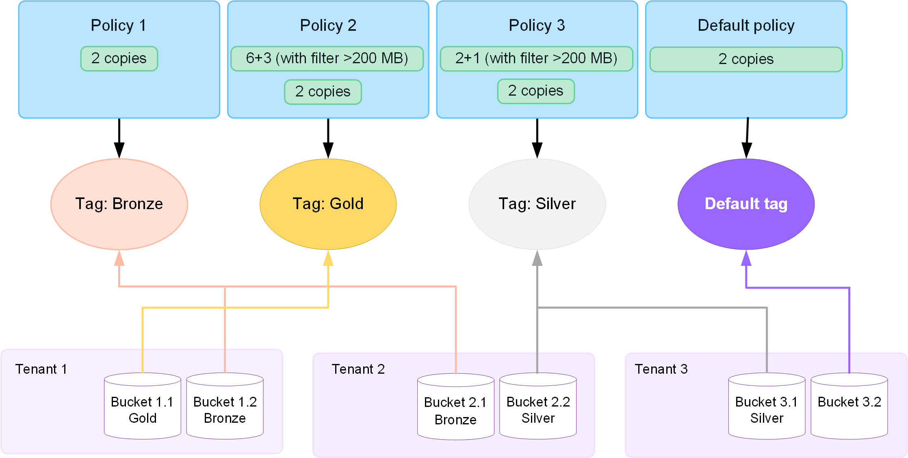

= 使用 ILM 策略
:allow-uri-read: 
:icons: font
:imagesdir: ../media/

[role="lead"]
信息生命周期管理 (ILM) 策略是一组有序的 ILM 规则，用于确定StorageGRID系统如何随时间管理对象数据。

CAUTION: 错误配置的 ILM 策略可能会导致无法恢复的数据丢失。在激活 ILM 策略之前，请仔细检查 ILM 策略及其 ILM 规则，然后模拟 ILM 策略。始终确认 ILM 策略能够按预期发挥作用。

== 默认 ILM 策略

安装StorageGRID并添加站点时，会自动创建默认 ILM 策略，如下所示：

* 如果您的网格包含一个站点，则默认策略包含一个默认规则，该规则在该站点复制每个对象的两个副本。
* 如果您的网格包含多个站点，则默认规则会在每个站点复制每个对象的一个副本。

如果默认策略不能满足您的存储要求，您可以创建自己的规则和策略。看link:what-ilm-rule-is.html["创建 ILM 规则"]和link:creating-ilm-policy.html["创建 ILM 策略"]。

== 一个或多个有效的 ILM 策略？

您一次可以拥有一个或多个活动的 ILM 策略。

=== 一项政策

如果您的网格将使用具有少量特定于租户和特定于存储桶的规则的简单数据保护方案，请使用单个活动的 ILM 策略。  ILM 规则可以包含过滤器来管理不同的存储桶或租户。

image::../media/ilm-policies-single.png[单一 ILM 策略图]

当您只有一个策略并且租户的要求发生变化时，您必须创建一个新的 ILM 策略或克隆现有策略以应用更改、模拟，然后激活新的 ILM 策略。  ILM 策略的更改可能会导致对象移动需要很多天的时间并造成系统延迟。

=== 多项政策

为了向租户提供不同的服务质量选项，您可以同时拥有多个有效策略。每个策略可以管理特定的租户、S3 存储桶和对象。当您针对特定租户或对象集应用或更改一个策略时，应用于其他租户和对象的策略不会受到影响。

ILM 策略标签:: 如果您希望允许租户在每个存储桶的基础上轻松地在多个数据保护策略之间切换，请使用带有_ILM 策略标签_的多个 ILM 策略。您将每个 ILM 策略分配给一个标签，然后租户标记一个存储桶以将策略应用于该存储桶。您只能在 S3 存储桶上设置 ILM 策略标签。
+
--
例如，您可能有三个标签，分别为金、银和铜。您可以根据策略存储对象的时间长度和位置为每个标签分配一个 ILM 策略。租户可以通过标记他们的存储桶来选择使用哪种策略。标记为“黄金”的存储桶由“黄金”策略管理，并获得“黄金”级别的数据保护和性能。

--
默认 ILM 策略标签:: 安装StorageGRID时会自动创建默认 ILM 策略标签。每个网格必须有一个分配给默认标签的活动策略。默认策略适用于任何未标记的 S3 存储桶。

== ILM 策略如何评估对象？

主动 ILM 策略控制对象的位置、持续时间和数据保护。

当客户端将对象保存到StorageGRID时，将根据策略中有序的 ILM 规则集对对象进行评估，如下所示：

. 如果策略中第一个规则的过滤器与某个对象匹配，则该对象将根据该规则的摄取行为进行摄取，并根据该规则的放置说明进行存储。
. 如果第一条规则的过滤器与对象不匹配，则根据策略中的每个后续规则评估该对象，直到匹配为止。
. 如果没有规则与对象匹配，则应用策略中默认规则的摄取行为和放置说明。默认规则是策略中的最后一条规则。默认规则必须适用于所有租户、所有 S3 存储桶和所有对象版本，并且不能使用任何高级过滤器。

== ILM 策略示例

例如，ILM 策略可能包含三个 ILM 规则，指定以下内容：

* *规则 1：为租户 A 复制副本*
+
** 匹配属于租户 A 的所有对象。
** 将这些对象作为三个副本存储在三个站点。
** 属于其他租户的对象不符合规则 1，因此根据规则 2 对它们进行评估。

* 规则 2：对大于 1 MB 的对象进行擦除编码
+
** 匹配来自其他租户的所有对象，但前提是它们大于 1 MB。这些较大的对象使用 6+3 擦除编码存储在三个站点。
** 与 1 MB 或更小的对象不匹配，因此这些对象根据规则 3 进行评估。

* *规则 3：2 个副本 2 个数据中心*（默认）
+
** 是策略中的最后一条规则，也是默认规则。不使用过滤器。
** 对不符合规则 1 或规则 2 的所有对象（不属于租户 A 且大小为 1 MB 或更小的对象）制作两个副本。

image::../media/ilm_policy_and_rules.png[ILM 政策和规则]

== 什么是有效政策和非有效政策？

每个StorageGRID系统必须至少有一个活动的 ILM 策略。如果您想要拥有多个有效的 ILM 策略，您可以创建 ILM 策略标签并为每个标签分配一个策略。然后，租户将标签应用到 S3 存储桶。默认策略适用于未分配策略标签的存储桶中的所有对象。

首次创建 ILM 策略时，您可以选择一个或多个 ILM 规则并按特定顺序排列它们。模拟策略以确认其行为后，即可激活它。

当您激活一个 ILM 策略时， StorageGRID会使用该策略来管理所有对象，包括现有对象和新摄取的对象。当实施新策略中的 ILM 规则时，现有对象可能会被移动到新位置。

如果您一次激活多个 ILM 策略，并且租户将策略标签应用于 S3 存储桶，则每个存储桶中的对象将根据分配给标签的策略进行管理。

StorageGRID系统跟踪已激活或停用的策略的历史记录。

== 创建 ILM 策略的注意事项

* 在测试系统中仅使用系统提供的策略，即基线 2 份策略。对于StorageGRID 11.6 及更早版本，此策略中的 Make 2 Copies 规则使用包含所有站点的所有存储节点存储池。如果您的StorageGRID系统有多个站点，则对象的两个副本可能会放置在同一个站点上。
+

NOTE: 所有存储节点存储池在安装StorageGRID 11.6 及更早版本期间自动创建。如果升级到更高版本的StorageGRID，所有存储节点池仍将存在。如果您将StorageGRID 11.7 或更高版本作为新安装进行安装，则不会创建所有存储节点池。

* 在设计新策略时，请考虑可能被纳入网格的所有不同类型的对象。确保策略包含按要求匹配和放置这些对象的规则。
* 使 ILM 策略尽可能简单。这样可以避免在StorageGRID系统随时间发生更改时对象数据无法得到预期保护的潜在危险情况。
* 确保策略中的规则顺序正确。当策略被激活时，新的和现有的对象将按照列出的顺序从顶部开始由规则进行评估。例如，如果策略中的第一个规则与某个对象匹配，则该对象将不会被任何其他规则评估。
* 每个 ILM 策略中的最后一条规则是默认 ILM 规则，它不能使用任何过滤器。如果某个对象尚未与另一个规则匹配，则默认规则控制该对象的放置位置以及保留时间。
* 在激活新策略之前，请检查该策略对现有对象的位置所做的任何更改。在评估和实施新位置时，更改现有对象的位置可能会导致临时资源问题。

