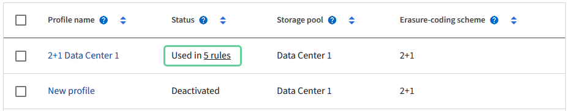

= 管理擦除编码配置文件
:allow-uri-read: 
:icons: font
:imagesdir: ../media/

[role="lead"]
您可以查看擦除编码配置文件的详细信息，并根据需要重命名配置文件。如果任何 ILM 规则当前未使用某个擦除编码配置文件，则可以停用该配置文件。

.开始之前
* 您已使用link:../admin/web-browser-requirements.html["支持的网络浏览器"]。
* 你有link:../admin/admin-group-permissions.html["所需的访问权限"]。

== 查看擦除编码配置文件详细信息

您可以查看擦除编码配置文件的详细信息，以确定其状态、使用的擦除编码方案和其他信息。

.步骤
. 选择 *配置* > *系统* > *擦除编码*。
. 选择配置文件。出现个人资料的详细信息页面。
. 或者，查看 ILM 规则选项卡以获取使用该配置文件的 ILM 规则列表以及使用这些规则的 ILM 策略。
. 或者，查看“存储节点”选项卡以获取有关配置文件存储池中每个存储节点的详细信息，例如其所在的站点和存储使用情况。

== 重命名擦除编码配置文件

您可能想要重命名擦除编码配置文件，以使配置文件的功能更加明显。

.步骤
. 选择 *配置* > *系统* > *擦除编码*。
. 选择您想要重命名的配置文件。
. 选择*重命名*。
. 为擦除编码配置文件输入一个唯一的名称。
+
擦除编码配置文件名称附加到 ILM 规则的放置指令中的存储池名称。

+

NOTE: 擦除编码配置文件名称必须是唯一的。如果使用现有配置文件的名称，即使该配置文件已被停用，也会出现验证错误。

. 选择*保存*。

== 停用擦除编码配置文件

如果您不再打算使用某个擦除编码配置文件，并且该配置文件当前未在任何 ILM 规则中使用，则可以停用该配置文件。

TIP: 确认没有正在进行的擦除编码数据修复操作或退役程序。如果您在进行这些操作时尝试停用擦除编码配置文件，则会返回错误消息。

.关于此任务
如果以下任一情况成立， StorageGRID将阻止您停用擦除编码配置文件：

* 擦除编码配置文件当前用于 ILM 规则。
* 任何 ILM 规则都不再使用擦除编码配置文件，但该配置文件的对象数据和奇偶校验片段仍然存在。

.步骤
. 选择 *配置* > *系统* > *擦除编码*。
. 在“活动”选项卡上，查看“*状态*”列以确认您要停用的擦除编码配置文件未在任何 ILM 规则中使用。
+
如果任何 ILM 规则中使用了擦除编码配置文件，则您无法停用该配置文件。在示例中，2+1 数据中心 1 配置文件至少在一条 ILM 规则中使用。

+

. 如果配置文件用于 ILM 规则，请按照以下步骤操作：
+
.. 选择 *ILM* > *规则*。
.. 选择每个规则并查看保留图以确定该规则是否使用您想要停用的擦除编码配置文件。
.. 如果 ILM 规则使用您想要停用的擦除编码配置文件，请确定该规则是否在任何 ILM 策略中使用。
.. 根据使用擦除编码配置文件的位置，完成表中的其他步骤。
+
[cols="2a,4a,1a"]
|===
| 该配置文件在何处使用？ | 停用配置文件之前要执行的附加步骤 | 请参阅这些附加说明 

 a| 
从未在任何 ILM 规则中使用过
 a| 
无需额外步骤。继续此过程。
 a| 
_没有任何_

 a| 
在任何 ILM 策略中从未使用过的 ILM 规则
 a| 
... 编辑或删除所有受影响的 ILM 规则。如果您编辑规则，请删除所有使用擦除编码配置文件的展示位置。
... 继续此过程。

 a| 
link:working-with-ilm-rules-and-ilm-policies.html["使用 ILM 规则和 ILM 策略"]

 a| 
在当前处于活动 ILM 策略中的 ILM 规则中
 a| 
... 克隆策略。
... 删除使用擦除编码配置文件的 ILM 规则。
... 添加一个或多个新的 ILM 规则以确保对象受到保护。
... 保存、模拟并激活新策略。
... 等待新策略应用并等待现有对象根据您添加的新规则移动到新位置。
+
*注意：*根据对象的数量和StorageGRID系统的大小，根据新的 ILM 规则，ILM 操作可能需要数周甚至数月才能将对象移动到新位置。

+
虽然您可以在擦除编码配置文件仍与数据关联时安全地尝试停用它，但停用操作将会失败。如果配置文件尚未准备好停用，则会显示一条错误消息通知您。

... 编辑或删除从策略中删除的规则。如果您编辑规则，请删除所有使用擦除编码配置文件的展示位置。
... 继续此过程。

 a| 
link:creating-ilm-policy.html["创建 ILM 策略"]

link:working-with-ilm-rules-and-ilm-policies.html["使用 ILM 规则和 ILM 策略"]

 a| 
在当前 ILM 策略中的 ILM 规则中
 a| 
... 编辑策略。
... 删除使用擦除编码配置文件的 ILM 规则。
... 添加一个或多个新的 ILM 规则以确保所有对象都受到保护。
... 保存策略。
... 编辑或删除从策略中删除的规则。如果您编辑规则，请删除所有使用擦除编码配置文件的展示位置。
... 继续此过程。

 a| 
link:creating-ilm-policy.html["创建 ILM 策略"]

link:working-with-ilm-rules-and-ilm-policies.html["使用 ILM 规则和 ILM 策略"]

|===
.. 刷新“擦除编码配置文件”页面以确保该配置文件未在 ILM 规则中使用。

. 如果配置文件未在 ILM 规则中使用，请选择单选按钮并选择 *停用*。出现“停用擦除编码配置文件”对话框。
+

TIP: 您可以选择同时停用多个配置文件，只要每个配置文件未在任何规则中使用。

. 如果您确定要停用该配置文件，请选择*停用*。

.结果
* 如果StorageGRID能够停用擦除编码配置文件，则其状态为“已停用”。您无法再为任何 ILM 规则选择此配置文件。您无法重新激活已停用的个人资料。
* 如果StorageGRID无法停用该配置文件，则会出现一条错误消息。例如，如果对象数据仍然与此配置文件关联，则会出现一条错误消息。您可能需要等待数周才能再次尝试停用过程。

