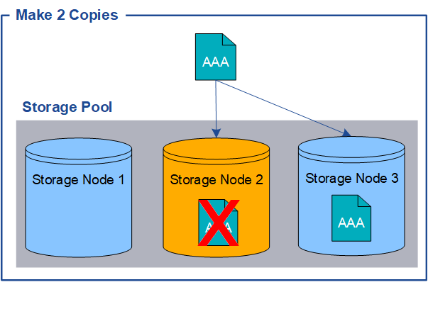

= 为什么不应该使用单副本复制
:allow-uri-read: 
:icons: font
:imagesdir: ../media/

[role="lead"]
创建 ILM 规则以创建复制副本时，应始终在放置说明中为任何时间段指定至少两个副本。

NOTE: 不要使用在任何时间段内仅创建一个复制副本的 ILM 规则。如果某个对象的副本只有一个，则当存储节点发生故障或出现重大错误时，该对象将会丢失。在升级等维护过程中，您还会暂时失去对该对象的访问权限。

在以下示例中，“制作 1 个副本”ILM 规则指定将对象的一个​​复制副本放置在包含三个存储节点的存储池中。当接收符合此规则的对象时， StorageGRID只会在一个存储节点上放置一个副本。

image::../media/ilm_replication_make_1_copy.png[ILM 复制制作 1 个副本]

当 ILM 规则仅创建对象的一个复制副本时，当存储节点不可用时，该对象将变得无法访问。在此示例中，每当存储节点 2 离线时（例如在升级或其他维护过程中），您将暂时失去对对象 AAA 的访问权限。如果存储节点 2 发生故障，您将完全丢失对象 AAA。

image::../media/ilm_replication_make_1_copy_sn_fails.png[ILM 复制制作 1 个副本 SN 失败]

为了避免丢失对象数据，您应该始终对要通过复制保护的所有对象制作至少两个副本。如果存在两个或多个副本，则当一个存储节点发生故障或离线时，您仍然可以访问该对象。

