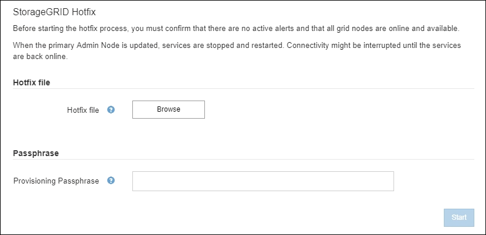

= 应用修补程序
:allow-uri-read: 
:icons: font
:imagesdir: ../media/

[role="lead"]
该修补程序首先自动应用到主管理节点。然后，您必须批准将修补程序应用到其他网格节点，直到所有节点都运行相同的软件版本。您可以通过选择批准单个网格节点、网格节点组或所有网格节点来自定义批准顺序。

.开始之前
* 您已审阅link:storagegrid-hotfix-procedure.html["应用修补程序的注意事项"]。
* 您有配置密码。
* 您拥有 Root 访问权限或维护权限。

.关于此任务
* 您可以延迟将修补程序应用到某个节点，但只有将修补程序应用到所有节点后，修补程序过程才算完成。
* 在完成修补程序过程之前，您无法执行StorageGRID软件升级或SANtricity OS 更新。

.步骤
. Sign inlink:../admin/web-browser-requirements.html["支持的网络浏览器"]。
. 选择*维护* > *系统* > *软件更新*。
+
出现软件更新页面。

+
image::../media/software_update_landing.png[软件更新登陆页面]

. 选择*应用修补程序*。
+
出现StorageGRID修补程序页面。

+

. 选择从NetApp支持站点下载的修补程序文件。
+
.. 选择*浏览*。
.. 找到并选择该文件。
+
`hotfix-install-_version_`

.. 选择*打开*。
+
文件已上传。上传完成后，文件名将显示在“详细信息”字段中。

+

NOTE: 不要更改文件名，因为它是验证过程的一部分。

. 在文本框中输入配置密码。
+
*开始*按钮变为启用状态。

. 选择“*开始*”。
+
出现一条警告，指出由于主管理节点上的服务重新启动，您的浏览器连接可能会暂时丢失。

. 选择“*确定*”开始将修补程序应用到主管理节点。
+
当修补程序启动时：

+
.. 运行修补程序验证。
+

NOTE: 如果报告任何错误，请解决它们，重新上传修补程序文件，然后再次选择*开始*。

.. 出现修补程序安装进度表。
+
该表显示网格中的所有节点以及每个节点的修补程序安装的当前阶段。表中的节点按类型分组（管理节点、网关节点和存储节点）。

.. 进度条到达完成，然后主管理节点显示为“完成”。
+
image::../media/hotfix_progress_table.png[热修复进度表]

. 或者，按*站点*、*名称*、*进度*、*阶段*或*详细信息*按升序或降序对每个分组中的节点列表进行排序。或者，在*搜索*框中输入一个术语来搜索特定的节点。
. 批准准备更新的网格节点。同一类型的已批准节点将一次升级一个。
+

CAUTION: 除非您确定节点已准备好更新，否则不要批准该节点的修补程序。当修补程序应用到网格节点时，该节点上的某些服务可能会重新启动。这些操作可能会导致与该节点通信的客户端的服务中断。

+
** 选择一个或多个*批准*按钮，将一个或多个单独的节点添加到修补程序队列。
** 选择每个分组内的“*全部批准*”按钮，将所有相同类型的节点添加到修补程序队列中。如果您在*搜索*框中输入了搜索条件，则*全部批准*按钮将适用于搜索条件选择的所有节点。
+

NOTE: 页面顶部的“*全部批准*”按钮可批准页面上列出的所有节点，而表格分组顶部的“*全部批准*”按钮仅可批准该组中的所有节点。如果节点升级的顺序很重要，请一次批准一个节点或节点组，并等到每个节点的升级完成后再批准下一个节点。

** 选择页面顶部的顶级*全部批准*按钮，将网格中的所有节点添加到修补程序队列中。
+

NOTE: 您必须先完成StorageGRID修补程序，然后才能开始其他软件更新。如果您无法完成修补程序，请联系技术支持。

** 选择“*删除*”或“*全部删除*”以从修补程序队列中删除一个节点或所有节点。
+
当阶段进展到“排队”之外时，*删除*按钮将被隐藏，并且您无法再从修补程序过程中删除该节点。

+
image::../media/approve_all_progresstable.png[带有删除按钮的修补程序进度]

. 等待修补程序应用到每个批准的网格节点。
+
当修补程序在所有节点上成功安装后，“修补程序安装进度”表将关闭。绿色横幅显示修补程序完成的日期和时间。

. 如果无法将修补程序应用到任何节点，请查看每个节点的错误，解决问题，然后重复这些步骤。
+
直到修补程序成功应用到所有节点后，该过程才算完成。您可以根据需要安全地重试修复过程多次，直到完成为止。

