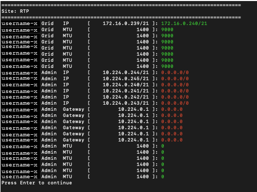

= 更改网格中所有节点的 IP 地址
:allow-uri-read: 
:icons: font
:imagesdir: ../media/

[role="lead"]
如果需要更改网格中所有节点的网格网络 IP 地址，则必须遵循此特殊程序。您不能使用更改单个节点的程序来更改整个网格范围的网格网络 IP。

.开始之前
* 你有 `Passwords.txt`文件。

为了确保电网成功启动，您必须同时进行所有更改。

NOTE: 此过程仅适用于电网。您不能使用此过程更改管理或客户端网络上的 IP 地址。

如果只想更改一个站点上节点的 IP 地址和 MTU，请按照link:changing-nodes-network-configuration.html["更改节点网络配置"]指示。

.步骤
. 提前计划需要在更改 IP 工具之外进行的更改，例如对 DNS 或 NTP 的更改，以及对单点登录 (SSO) 配置的更改（如果使用）。
+

NOTE: 如果网格无法通过新 IP 地址访问现有的 NTP 服务器，请在执行更改 IP 过程之前添加新的 NTP 服务器。

+

NOTE: 如果网格无法通过新 IP 地址访问现有的 DNS 服务器，请在执行更改 IP 过程之前添加新的 DNS 服务器。

+

NOTE: 如果您的StorageGRID系统启用了 SSO，并且使用管理节点 IP 地址（而不是建议的完全限定域名）配置了任何依赖方信任，请准备在更改 IP 地址后立即在 Active Directory 联合身份验证服务 (AD FS) 中更新或重新配置这些依赖方信任。看link:../admin/configuring-sso.html["配置单点登录"] 。

+

NOTE: 如果需要，为新的 IP 地址添加新的子网。

. 登录到主管理节点：
+
.. 输入以下命令： `ssh admin@_primary_Admin_Node_IP_`
.. 输入 `Passwords.txt`文件。
.. 输入以下命令切换到root： `su -`
.. 输入 `Passwords.txt`文件。

+
当您以 root 身份登录时，提示符将从 `$`到 `#`。

. 输入以下命令启动更改 IP 工具： `change-ip`
. 在提示符下输入配置密码。
+
出现主菜单。默认情况下， `Selected nodes`字段设置为 `all`。

+
image::../media/change_ip_tool_main_menu.png[屏幕截图显示了更改 IP 工具的欢迎屏幕]

. 在主菜单上，选择*2*编辑所有节点的IP/子网掩码、网关和MTU信息。
+
.. 选择*1*对电网进行更改。
+
做出选择后，提示会显示节点名称、网格网络名称、数据类型（IP/掩码、网关或 MTU）和当前值。

+
编辑 DHCP 配置接口的 IP 地址、前缀长度、网关或 MTU 将会把接口更改为静态。每个由 DHCP 配置的接口之前都会显示一条警告。

+
接口配置为 `fixed`無法編輯。

.. 要设置新值，请按照当前值显示的格式输入。
.. 编辑完所有想要更改的节点后，输入 *q* 返回主菜单。
+
您的更改将保留，直到被清除或应用为止。

. 选择以下选项之一来检查您的更改：
+
** *5*：在隔离的输出中显示编辑，仅显示更改的项目。更改以绿色（添加）或红色（删除）突出显示，如示例输出所示：
+

** *6*：在显示完整配置的输出中显示编辑。更改以绿色（添加）或红色（删除）突出显示。
+

NOTE: 某些命令行界面可能会使用删除线格式显示添加和删除的内容。正确显示取决于您的终端客户端是否支持必要的 VT100 转义序列。

. 选择选项 *7* 来验证所有更改。
+
此验证可确保不违反网格网络的规则，例如不使用重叠子网。

+
在此示例中，验证返回错误。

+
image::../media/change_ip_tool_validate_sample_error_messages.gif[屏幕截图由周围文字描述]

+
在此示例中，验证已通过。

+
image::../media/change_ip_tool_validate_sample_passed_messages.gif[屏幕截图由周围文字描述]

. 验证通过后，选择*10*应用新的网络配置。
. 选择*stage*以在下次重新启动节点时应用更改。
+

NOTE: 您必须选择*阶段*。不要执行滚动重启，无论是手动还是选择*apply*而不是*stage*；电网将无法成功启动。

. 更改完成后，选择 *0* 退出更改 IP 工具。
. 同时关闭所有节点。
+

NOTE: 必须关闭整个电网，以便所有节点同时关闭。

. 进行所需的物理或虚拟网络更改。
. 验证所有网格节点是否已关闭。
. 打开所有节点的电源。
. 电网启动成功后：
+
.. 如果您添加了新的 NTP 服务器，请删除旧的 NTP 服务器值。
.. 如果您添加了新的 DNS 服务器，请删除旧的 DNS 服务器值。

. 从网格管理器下载新的恢复包。
+
.. 选择*维护* > *系统* > *恢复包*。
.. 输入配置密码。

.相关信息
* link:adding-to-or-changing-subnet-lists-on-grid-network.html["在网格网络上添加或更改子网列表"]
* link:shutting-down-grid-node.html["关闭网格节点"]

