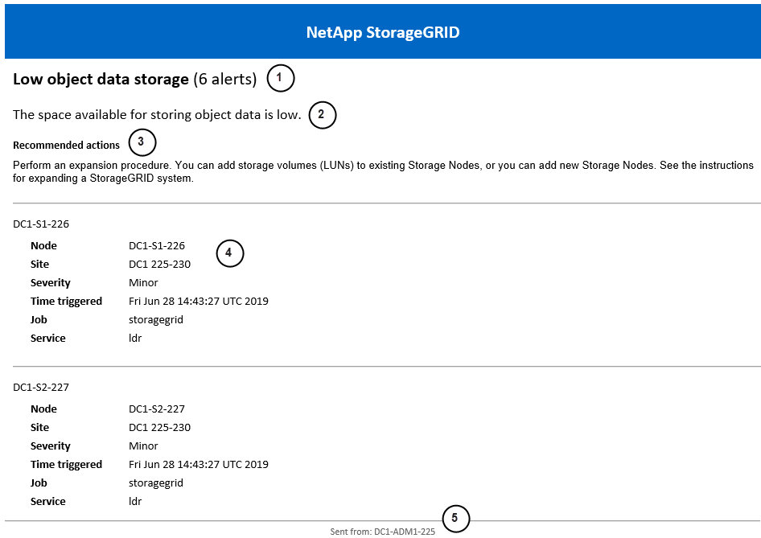

= 设置警报的电子邮件通知
:allow-uri-read: 
:icons: font
:imagesdir: ../media/

[role="lead"]
如果您希望在发生警报时发送电子邮件通知，则必须提供有关 SMTP 服务器的信息。您还必须输入警报通知收件人的电子邮件地址。

.开始之前
* 您已使用link:../admin/web-browser-requirements.html["支持的网络浏览器"]。
* 你有link:../admin/admin-group-permissions.html["管理警报或 Root 访问权限"]。

.关于此任务
用于警报通知的电子邮件设置不用于AutoSupport包。但是，您可以对所有通知使用同一个电子邮件服务器。

如果您的StorageGRID部署包含多个管理节点，则主管理节点是警报通知、 AutoSupport包以及 SNMP 陷阱和通知的首选发送者。如果主管理节点不可用，其他管理节点会暂时发送通知。看link:../primer/what-admin-node-is.html["什么是管理节点？"] 。

.步骤
. 选择*警报* > *电子邮件设置*。
+
出现电子邮件设置页面。

. 选中“启用电子邮件通知”复选框，表明您希望在警报达到配置的阈值时发送通知电子邮件。
+
出现电子邮件（SMTP）服务器、传输层安全性（TLS）、电子邮件地址和过滤器部分。

. 在电子邮件（SMTP）服务器部分，输入StorageGRID访问您的 SMTP 服务器所需的信息。
+
如果您的 SMTP 服务器需要身份验证，则必须提供用户名和密码。

+
[cols="1a,2a"]
|===
| 字段 | Enter 

 a| 
邮件服务器
 a| 
SMTP 服务器的完全限定域名 (FQDN) 或 IP 地址。

 a| 
端口
 a| 
用于访问 SMTP 服务器的端口。必须介于 1 到 65535 之间。

 a| 
用户名（可选）
 a| 
如果您的 SMTP 服务器需要身份验证，请输入用于身份验证的用户名。

 a| 
密码（可选）
 a| 
如果您的 SMTP 服务器需要身份验证，请输入用于身份验证的密码。

|===
. 在电子邮件地址部分，输入发件人和每个收件人的电子邮件地址。
+
.. 对于*发件人电子邮件地址*，请指定一个有效的电子邮件地址作为警报通知的发件人地址。
+
例如：  `storagegrid-alerts@example.com`

.. 在收件人部分，输入每个电子邮件列表或在发生警报时应接收电子邮件的人员的电子邮件地址。
+
选择加号图标image:../media/icon_plus_sign_black_on_white.gif["加号图标"]添加收件人。

. 如果与 SMTP 服务器通信需要传输层安全性 (TLS)，请在传输层安全性 (TLS) 部分中选择 *需要 TLS*。
+
.. 在 *CA 证书* 字段中，提供用于验证 SMTP 服务器身份的 CA 证书。
+
您可以将内容复制并粘贴到此字段中，或者选择*浏览*并选择文件。

+
您必须提供一个包含来自每个中间颁发证书机构 (CA) 的证书的文件。该文件应包含每个 PEM 编码的 CA 证书文件，按证书链顺序连接。

.. 如果您的 SMTP 电子邮件服务器要求电子邮件发件人提供客户端证书进行身份验证，请选中“*发送客户端证书*”复选框。
.. 在 *客户端证书* 字段中，提供 PEM 编码的客户端证书以发送到 SMTP 服务器。
+
您可以将内容复制并粘贴到此字段中，或者选择*浏览*并选择文件。

.. 在 *私钥* 字段中，以未加密的 PEM 编码输入客户端证书的私钥。
+
您可以将内容复制并粘贴到此字段中，或者选择*浏览*并选择文件。

+

NOTE: 如果您需要编辑电子邮件设置，请选择铅笔图标image:../media/icon_edit_tm.png["编辑图标"]更新此字段。

. 在“过滤器”部分中，选择哪些警报严重性级别应导致电子邮件通知，除非特定警报的规则已被静音。
+
[cols="1a,2a"]
|===
| 严重性 | 描述 

 a| 
轻微、严重、严重
 a| 
当满足警报规则的次要、主要或关键条件时，会发送电子邮件通知。

 a| 
重大、关键
 a| 
当满足警报规则的主要或关键条件时，会发送电子邮件通知。对于轻微警报，不会发送通知。

 a| 
仅限关键
 a| 
仅当满足警报规则的关键条件时才会发送电子邮件通知。对于轻微或重大警报，不会发送通知。

|===
. 当您准备好测试电子邮件设置时，请执行以下步骤：
+
.. 选择*发送测试电子邮件*。
+
出现一条确认消息，表明测试电子邮件已发送。

.. 检查所有电子邮件收件人的收件箱并确认收到了测试电子邮件。
+

NOTE: 如果几分钟内没有收到电子邮件或触发了*电子邮件通知失败*警报，请检查您的设置并重试。

.. Sign in到任何其他管理节点并发送测试电子邮件以验证所有站点的连接。
+

NOTE: 测试警报通知时，您必须登录每个管理节点以验证连接性。这与测试AutoSupport包形成对比，在测试 AutoSupport 包时，所有管理节点都会发送测试电子邮件。

. 选择*保存*。
+
发送测试电子邮件不会保存您的设置。您必须选择*保存*。

+
电子邮件设置已保存。

== 警报电子邮件通知中包含的信息

配置 SMTP 电子邮件服务器后，当触发警报时，电子邮件通知将发送给指定的收件人，除非警报规则被静默抑制。看link:silencing-alert-notifications.html["静音警报通知"] 。

电子邮件通知包含以下信息：

[cols="1a,6a"]
|===
| 大喊 | 描述 

 a| 
1
 a| 
警报的名称，后跟此警报的活动实例数。

 a| 
2
 a| 
警报的描述。

 a| 
3
 a| 
针对警报的任何建议操作。

 a| 
4
 a| 
有关警报的每个活动实例的详细信息，包括受影响的节点和站点、警报严重性、触发警报规则的 UTC 时间以及受影响的作业和服务的名称。

 a| 
5
 a| 
发送通知的管理节点的主机名。

|===

== 警报如何分组

为了防止在触发警报时发送过多的电子邮件通知， StorageGRID尝试将多个警报分组到同一个通知中。

请参阅下表，了解StorageGRID如何在电子邮件通知中对多个警报进行分组的示例。

[cols="1a,1a"]
|===
| 行为 | 示例 

 a| 
每个警报通知仅适用于具有相同名称的警报。如果同时触发两个不同名称的警报，则会发送两封电子邮件通知。
 a| 
* 警报 A 同时在两个节点上触发。仅发送一条通知。
* 节点1上触发Alert A，同时节点2上触发Alert B。发送两个通知——每个警报一个通知。

 a| 
对于特定节点上的特定警报，如果达到多个严重程度的阈值，则仅针对最严重的警报发送通知。
 a| 
* 警报 A 被触发，并且达到轻微、严重和严重警报阈值。对于严重警报，将发送一条通知。

 a| 
第一次触发警报时， StorageGRID会等待 2 分钟才发送通知。如果在此期间触发了其他同名警报， StorageGRID会将所有警报分组到初始通知中。
 a| 
. 警报 A 于 08:00 在节点 1 上触发。未发送任何通知。
. 警报 A 于 08:01 在节点 2 上触发。未发送任何通知。
. 08:02 时，发送通知报告两次警报实例。

 a| 
如果触发另一个同名警报， StorageGRID会等待 10 分钟再发送新通知。新的通知会报告所有活动警报（尚未静音的当前警报），即使这些警报之前已报告过。
 a| 
. 警报 A 于 08:00 在节点 1 上触发。通知于 08:02 发送。
. 警报 A 于 08:05 在节点 2 上触发。第二条通知于 08:15（10 分钟后）发送。两个节点均已报告。

 a| 
如果当前存在多个同名警报，并且其中一个警报已解决，则当该警报在已解决该警报的节点上再次发生时，不会发送新的通知。
 a| 
. 节点 1 触发警报 A。已发送通知。
. 节点 2 触发警报 A。已发送第二条通知。
. 警报 A 对于节点 2 已解决，但对于节点 1 仍然有效。
. 节点 2 再次触发警报 A。由于警报对于节点 1 仍然有效，因此不会发送新的通知。

 a| 
StorageGRID会每 7 天继续发送一次电子邮件通知，直到警报的所有实例都得到解决或警报规则被静音。
 a| 
. 3 月 8 日，针对节点 1 触发警报 A。已发送通知。
. 警报 A 尚未解决或消除。  3 月 15 日、3 月 22 日、3 月 29 日等将发送额外通知。

|===

== 解决警报电子邮件通知问题

如果触发了“电子邮件通知失败”警报或您无法收到测试警报电子邮件通知，请按照以下步骤解决问题。

.开始之前
* 您已使用link:../admin/web-browser-requirements.html["支持的网络浏览器"]。
* 你有link:../admin/admin-group-permissions.html["管理警报或 Root 访问权限"]。

.步骤
. 验证您的设置。
+
.. 选择*警报* > *电子邮件设置*。
.. 验证电子邮件（SMTP）服务器设置是否正确。
.. 验证您是否为收件人指定了有效的电子邮件地址。

. 检查您的垃圾邮件过滤器，确保电子邮件没有被发送到垃圾邮件文件夹。
. 请您的电子邮件管理员确认来自发件人地址的电子邮件没有被阻止。
. 收集管理节点的日志文件，然后联系技术支持。
+
技术支持可以使用日志中的信息来帮助确定出了什么问题。例如，连接到您指定的服务器时，prometheus.log 文件可能会显示错误。

+
看link:collecting-log-files-and-system-data.html["收集日志文件和系统数据"] 。

