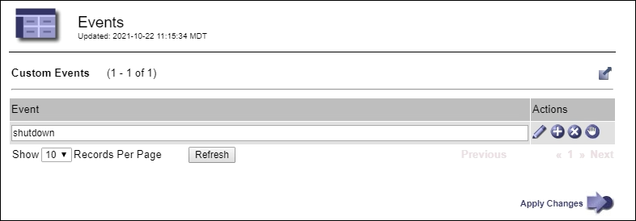

= 监视事件
:allow-uri-read: 
:icons: font
:imagesdir: ../media/

[role="lead"]
您可以监控网格节点检测到的事件，包括您创建的用于跟踪记录到 syslog 服务器的事件的自定义事件。网格管理器中显示的“最后事件”消息提供了有关最近事件的更多信息。

事件消息也列在 `/var/local/log/bycast-err.log`日志档案。查看link:logs-files-reference.html["日志文件参考"]。

SMTT（总事件）警报可能因网络问题、断电或升级等问题而反复触发。本节包含有关调查事件的信息，以便您更好地了解这些警报发生的原因。如果由于已知问题而发生事件，则可以安全地重置事件计数器。

.步骤
. 查看每个网格节点的系统事件：
+
.. 选择*支持* > *工具* > *网格拓扑*。
.. 选择 *_site_* > *_grid node_* > *SSM* > *Events* > *Overview* > *Main*。

. 生成先前事件消息的列表以帮助隔离过去发生的问题：
+
.. 选择*支持* > *工具* > *网格拓扑*。
.. 选择 *_site_* > *_grid node_* > *SSM* > *Events* > *Reports*。
.. 选择*文本*。
+
*Last Event* 属性未显示在link:using-charts-and-reports.html["图表视图"]。要查看它：

.. 将*属性*更改为*最后事件*。
.. 或者，选择*快速查询*的时间段。
.. 选择*更新*。
+
image::../media/events_report.gif[活动页面]

== 创建自定义系统日志事件

自定义事件允许您跟踪记录到 syslog 服务器的所有内核、守护进程、错误和关键级别用户事件。自定义事件可用于监控系统日志消息（以及网络安全事件和硬件故障）的发生。

.关于此任务
考虑创建自定义事件来监控重复出现的问题。以下注意事项适用于自定义事件。

* 创建自定义事件后，每次发生的事件都会受到监控。
* 根据关键字创建自定义事件 `/var/local/log/messages`文件，这些文件中的日志必须是：
+
** 由内核生成
** 由守护进程或用户程序在错误或严重级别生成

*注意：*并非所有条目 `/var/local/log/messages`除非文件满足上述要求，否则将不匹配。

.步骤
. 选择 *支持* > *警报（遗留）* > *自定义事件*。
. 点击“编辑”image:../media/icon_nms_edit.gif["铅笔图标"] （或*插入*image:../media/icon_nms_insert.gif["加号图标"]如果这不是第一次发生）。
. 输入自定义事件字符串，例如，shutdown
+

. 选择*应用更改*。
. 选择*支持* > *工具* > *网格拓扑*。
. 选择 *_grid node_* > *SSM* > *Events*。
. 在事件表中找到自定义事件的条目，并监视*Count*的值。
+
如果计数增加，则表示您正在监控的自定义事件正在该网格节点上触发。

+
image::../media/custom_events_count.png[SSM > 事件 > 概览页面]

== 将自定义事件的数量重置为零

如果您只想重置自定义事件的计数器，则必须使用支持菜单中的网格拓扑页面。

重置计数器会导致下一个事件触发警报。相反，当您确认警报时，只有达到下一个阈值水平时才会重新触发该警报。

.步骤
. 选择*支持* > *工具* > *网格拓扑*。
. 选择 *_grid node_* > *SSM* > *Events* > *Configuration* > *Main*。
. 选择自定义事件的*重置*复选框。
+
image::../media/custom_events_reset.gif[屏幕截图位于 SSM > 事件 > 配置 > 主要]

. 选择*应用更改*。

