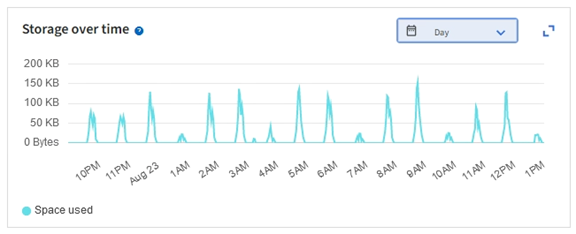
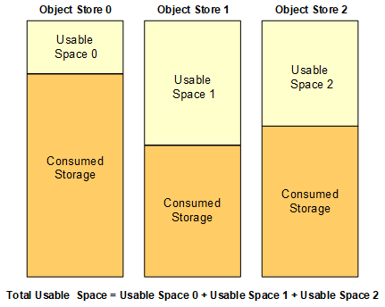

= 监控存储容量
:allow-uri-read: 
:icons: font
:imagesdir: ../media/

[role="lead"]
监控可用的总空间，以确保StorageGRID系统不会耗尽对象或对象元数据的存储空间。

StorageGRID分别存储对象数据和对象元数据，并为包含对象元数据的分布式 Cassandra 数据库保留特定大小的空间。监控对象和对象元数据所消耗的空间总量，以及每个空间所消耗空间量的趋势。这将使您能够提前规划添加节点并避免任何服务中断。

你可以link:viewing-storage-tab.html["查看存储容量信息"]针对整个网格、每个站点以及StorageGRID系统中的每个存储节点。

== 监控整个电网的存储容量

监控网格的总体存储容量，以确保有足够的可用空间用于对象数据和对象元数据。了解存储容量如何随时间变化可以帮助您在网格的可用存储容量被消耗之前计划添加存储节点或存储卷。

网格管理器仪表板可让您快速评估整个网格和每个数据中心可用的存储空间。节点页面提供了对象数据和对象元数据的更详细值。

.步骤
. 评估整个电网和每个数据中心有多少可用存储空间。
+
.. 选择“仪表板”>“概览”。
.. 注意数据空间使用情况细分和元数据允许空间使用情况细分卡上的值。每张卡片列出了存储使用率、已用空间容量以及站点可用或允许的总空间。
+

NOTE: 摘要不包括档案媒体。

+
image::../media/dashboard_data_and_metadata_space_usage_breakdown.png[数据和元数据空间使用情况明细]

.. 请注意随时间变化的存储卡上的图表。使用时间段下拉菜单来帮助您确定存储消耗的速度。
+

. 使用“节点”页面可以了解有关已使用多少存储空间以及网格上还有多少存储空间可用于对象数据和对象元数据的更多详细信息。
+
.. 选择*NODES*。
.. 选择*_grid_* > *存储*。
+
image::../media/nodes_deployment_storage_tab.png[节点部署存储选项卡]

.. 将光标放在*已用存储 - 对象数据*和*已用存储 - 对象元数据*图表上，查看整个网格可用的对象存储和对象元数据存储量，以及随时间推移已用存储量。
+

NOTE: 站点或网格的总值不包括至少五分钟未报告指标的节点，例如离线节点。

. 计划在网格的可用存储容量被消耗之前执行扩展以添加存储节点或存储卷。
+
在规划扩展时间时，请考虑采购和安装额外存储需要多长时间。

+

NOTE: 如果您的 ILM 策略使用擦除编码，您可能更愿意在现有存储节点约 70% 满时进行扩展，以减少必须添加的节点数量。

+
有关规划存储扩展的更多信息，请参阅link:../expand/index.html["扩展StorageGRID的说明"]。

== 监控每个存储节点的存储容量

监控每个存储节点的总可用空间，以确保节点有足够的空间容纳新的对象数据。

.关于此任务
可用空间是可用于存储对象的存储空间量。存储节点的总可用空间是通过将节点内所有对象存储的可用空间加在一起来计算的。

.步骤
. 选择 *NODES* > *_Storage Node_* > *Storage*。
+
出现该节点的图形和表格。

. 将光标置于使用的存储 - 对象数据图上。
+
显示以下值：

+
** *已使用（％）*：已用于对象数据的总可用空间的百分比。
** *已使用*：已用于对象数据的总可用空间量。
** *复制数据*：此节点、站点或网格上复制的对象数据量的估计值。
** *擦除编码数据*：此节点、站点或网格上擦除编码对象数据量的估计值。
** *总计*：此节点、站点或网格上可用空间的总量。使用值是 `storagegrid_storage_utilization_data_bytes`公制。
+
image::../media/nodes_page_storage_used_object_data.png[节点页面存储使用对象数据]

. 查看图表下方的卷和对象存储表中的可用值。
+

NOTE: 要查看这些值的图表，请点击图表图标image:../media/icon_chart_new_for_11_5.png["图表图标"]在可用列中。

+
image::../media/nodes_page_storage_tables.png[对象存储表]

. 监控一段时间内的值以估计可用存储空间的消耗率。
. 为了维持正常的系统操作，请在可用空间耗尽之前添加存储节点、添加存储卷或存档对象数据。
+
在规划扩展时间时，请考虑采购和安装额外存储需要多长时间。

+

NOTE: 如果您的 ILM 策略使用擦除编码，您可能更愿意在现有存储节点约 70% 满时进行扩展，以减少必须添加的节点数量。

+
有关规划存储扩展的更多信息，请参阅link:../expand/index.html["扩展StorageGRID的说明"]。

+
这link:../troubleshoot/troubleshooting-low-object-data-storage-alert.html["低对象数据存储"]当存储节点上存储对象数据的空间不足时，会触发警报。

== 监控每个存储节点的对象元数据容量

监控每个存储节点的元数据使用情况，以确保有足够的空间可用于基本数据库操作。在对象元数据超过允许的元数据空间的 100% 之前，必须在每个站点添加新的存储节点。

.关于此任务
StorageGRID在每个站点维护对象元数据的三个副本，以提供冗余并保护对象元数据免于丢失。这三个副本均匀分布在每个站点的所有存储节点上，使用每个存储节点的存储卷 0 上为元数据保留的空间。

在某些情况下，网格的对象元数据容量可能比其对象存储容量消耗得更快。例如，如果您通常摄取大量小对象，则可能需要添加存储节点来增加元数据容量，即使剩余足够的对象存储容量。

一些可以增加元数据使用量的因素包括用户元数据和标签的大小和数量、分段上传中的部分总数以及 ILM 存储位置的更改频率。

.步骤
. 选择 *NODES* > *_Storage Node_* > *Storage*。
. 将光标放在使用的存储 - 对象元数据图上以查看特定时间的值。
+
image::../media/storage_used_object_metadata.png[已用存储 - 对象元数据]

+
用过的 （％）:: 此存储节点上已使用的允许元数据空间的百分比。
+
--
Prometheus 指标： `storagegrid_storage_utilization_metadata_bytes`和 `storagegrid_storage_utilization_metadata_allowed_bytes`

--
已用:: 此存储节点上已使用的允许元数据空间的字节数。
+
--
Prometheus 指标： `storagegrid_storage_utilization_metadata_bytes`

--
允许:: 此存储节点上允许的对象元数据的空间。要了解如何确定每个存储节点的该值，请参阅link:../admin/managing-object-metadata-storage.html#allowed-metadata-space["允许元数据空间的完整描述"]。
+
--
Prometheus 指标： `storagegrid_storage_utilization_metadata_allowed_bytes`

--
实际预留:: 此存储节点上为元数据保留的实际空间。包括允许的空间和基本元数据操作所需的空间。要了解如何为每个存储节点计算此值，请参阅link:../admin/managing-object-metadata-storage.html#actual-reserved-space-for-metadata["元数据实际保留空间的完整描述"]。
+
--
_Prometheus 指标将在未来的版本中添加。_

--

+

NOTE: 站点或网格的总值不包括至少五分钟未报告指标的节点，例如离线节点。

. 如果 *Used (%)* 值为 70% 或更高，则通过向每个站点添加存储节点来扩展您的StorageGRID系统。
+

CAUTION: 当*已使用（％）*值达到某些阈值时，会触发*低元数据存储*警报。如果对象元数据使用超过 100% 的允许空间，则可能会出现不良结果。

+
当您添加新节点时，系统会自动重新平衡站点内所有存储节点的对象元数据。查看link:../expand/index.html["扩展StorageGRID系统的说明"]。

== 监控空间使用情况预测

监控用户数据和元数据的空间使用预测，以估计何时需要link:../expand/index.html["展开网格"]。

如果您注意到消费率随时间而变化，请从*平均*下拉菜单中选择一个较短的范围，以仅反映最近的摄取模式。如果您注意到季节性模式，请选择更长的范围。

如果您有新的StorageGRID安装，请在评估空间使用情况预测之前允许数据和元数据累积。

.步骤
. 在仪表板上，选择*存储*。
. 查看仪表板卡、按存储池预测数据使用情况和按站点预测元数据使用情况。
. 使用这些值来估计何时需要添加新的存储节点来存储数据和元数据。

image::../media/forecast-metadata-usage.png[站点元数据使用情况预测]
