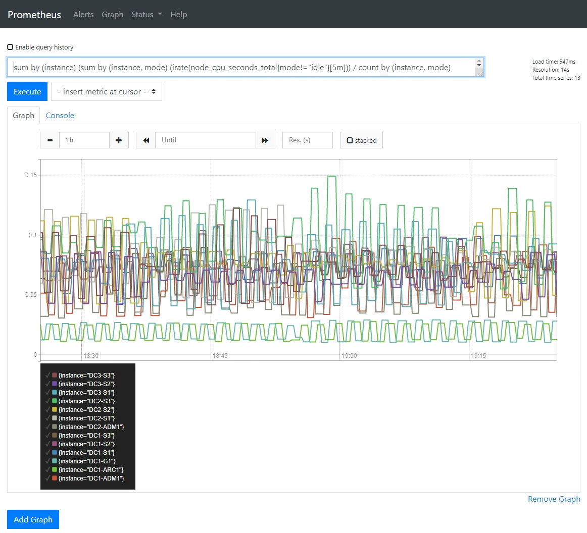

= 运行诊断
:allow-uri-read: 
:icons: font
:imagesdir: ../media/

[role="lead"]
在解决问题时，您可以与技术支持合作，在StorageGRID系统上运行诊断程序并查看结果。

* link:reviewing-support-metrics.html["审查支持指标"]
* link:commonly-used-prometheus-metrics.html["常用的 Prometheus 指标"]

.开始之前
* 您已使用link:../admin/web-browser-requirements.html["支持的网络浏览器"]。
* 你有link:../admin/admin-group-permissions.html["特定访问权限"]。

.关于此任务
诊断页面对电网的当前状态执行一系列诊断检查。每个诊断检查可以具有以下三种状态之一：

* image:../media/icon_alert_green_checkmark.png["图标警报绿色复选标记"]*正常*：所有值均在正常范围内。
* image:../media/icon_alert_yellow_minor.png["图标警报黄色轻微"]*注意*：一个或多个值超出正常范围。
* image:../media/icon_alert_red_critical.png["图标警报红色严重"]*警告*：一个或多个值明显超出正常范围。

诊断状态与当前警报无关，并且可能不会指示电网的运行问题。例如，即使没有触发警报，诊断检查也可能显示警告状态。

.步骤
. 选择*支持* > *工具* > *诊断*。
+
出现“诊断”页面并列出每个诊断检查的结果。结果按严重程度排序（警告、注意、正常）。在每个严重性级别中，结果按字母顺序排序。

+
在此示例中，所有诊断均处于正常状态。

+
image::../media/support_diagnostics_page.png[支持诊断页面]

. 要了解有关特定诊断的更多信息，请单击该行中的任意位置。
+
将显示有关诊断及其当前结果的详细信息。列出了以下详细信息：

+
** *状态*：此诊断的当前状态：正常、注意或警告。
** *Prometheus 查询*：如果用于诊断，则使用 Prometheus 表达式来生成状态值。  （Prometheus 表达式并不用于所有诊断。）
** *阈值*：如果可用于诊断，则系统为每个异常诊断状态定义的阈值。  （阈值并不用于所有诊断。）
+

NOTE: 您无法更改这些阈值。

** *状态值*：显示整个StorageGRID系统的诊断状态和值的表格。在此示例中，显示了StorageGRID系统中每个节点的当前 CPU 利用率。所有节点值均低于注意和警告阈值，因此诊断的总体状态为正常。

+
image::../media/support_diagnostics_cpu_utilization.png[支持诊断 CPU 利用率]

. *可选*：要查看与此诊断相关的 Grafana 图表，请单击 *Grafana 仪表板* 链接。
+
并非所有诊断都会显示此链接。

+
出现相关的 Grafana 仪表板。在此示例中，节点仪表板显示该节点随时间变化的 CPU 利用率以及该节点的其他 Grafana 图表。

+

NOTE: 您还可以从 *SUPPORT* > *Tools* > *Metrics* 页面的 Grafana 部分访问预先构建的 Grafana 仪表板。

+
image::../media/grafana_dashboard_nodes.png[Grafana 仪表板节点]

. *可选*：要查看 Prometheus 随时间变化的表达图表，请单击*在 Prometheus 中查看*。
+
出现诊断中使用的表达式的 Prometheus 图表。

+

