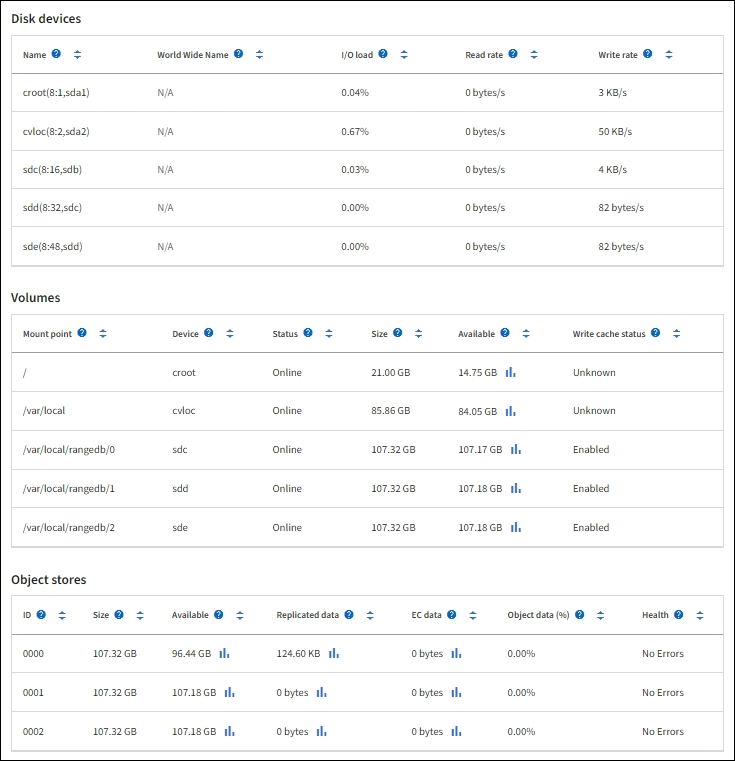

= 查看硬件选项卡
:allow-uri-read: 
:icons: font
:imagesdir: ../media/

[role="lead"]
硬件选项卡显示每个节点的 CPU 利用率和内存使用情况，以及有关设备的其他硬件信息。

NOTE: 网格管理器会随着每个版本的发布而更新，并且可能与本页上的示例屏幕截图不匹配。

所有节点均显示“硬件”选项卡。

image::../media/nodes_page_hardware_tab_graphs.png[节点页面硬件选项卡]

要显示不同的时间间隔，请选择图表或图形上方的其中一个控件。您可以显示 1 小时、1 天、1 周或 1 个月间隔内可用的信息。您还可以设置自定义间隔，以便指定日期和时间范围。

要查看 CPU 利用率和内存使用情况的详细信息，请将光标放在每个图表上。

image::../media/nodes_page_memory_usage_details.png[节点页面 > 硬件 > 内存使用情况详情]

如果该节点是设备节点，则此选项卡还包含一个包含有关设备硬件的更多信息的部分。

== 查看有关设备存储节点的信息

节点页面列出了有关每个设备存储节点的服务健康状况以及所有计算、磁盘设备和网络资源的信息。您还可以看到内存、存储硬件、控制器固件版本、网络资源、网络接口、网络地址以及接收和传输数据。

.步骤
. 从“节点”页面中，选择一个设备存储节点。
. 选择*概览*。
+
概述选项卡的节点信息部分显示节点的摘要信息，例如节点的名称、类型、ID 和连接状态。  IP 地址列表包括每个地址的接口名称，如下所示：

+
** *eth*：网格网络、管理网络或客户端网络。
** *hic*：设备上的物理 10、25 或 100 GbE 端口之一。这些端口可以绑定在一起并连接到StorageGRID网格网络（eth0）和客户端网络（eth2）。
** *mtc*：设备上的物理 1 GbE 端口之一。一个或多个 mtc 接口绑定在一起形成StorageGRID管理网络接口 (eth1)。您可以保留其他 mtc 接口，以供数据中心的技术人员临时进行本地连接。
+
image::../media/nodes_page_overview_tab_extended.png[节点页面概览扩展]

+
概览选项卡的警报部分显示该节点的任何活动警报。

. 选择“*硬件*”以查看有关该设备的更多信息。
+
.. 查看 CPU 利用率和内存图表以确定一段时间内的 CPU 和内存使用率百分比。要显示不同的时间间隔，请选择图表或图形上方的其中一个控件。您可以显示 1 小时、1 天、1 周或 1 个月间隔内可用的信息。您还可以设置自定义间隔，以便指定日期和时间范围。
+
image::../media/nodes_page_hardware_tab_graphs.png[硬件图]

.. 向下滚动以查看设备的组件表。该表包含设备型号名称、控制器名称、序列号和 IP 地址以及每个组件的状态等信息。
+

NOTE: 某些字段（例如计算控制器BMC IP 和计算硬件）仅出现在具有该功能的设备上。

+
存储架和扩展架（如果它们是安装的一部分）的组件出现在设备表下方的单独表中。

+
image::../media/nodes_page_hardware_tab_for_appliance.png[设备的节点页面硬件选项卡]

+
[cols="1a,2a"]
|===
| Appliance 表中的字段 | 描述 

 a| 
家电型号
 a| 
SANtricity OS 中显示的此StorageGRID设备的型号。

 a| 
存储控制器名称
 a| 
SANtricity OS 中显示的此StorageGRID设备的名称。

 a| 
存储控制器A管理IP
 a| 
存储控制器 A 上管理端口 1 的 IP 地址。您可以使用此 IP 访问SANtricity OS 来解决存储问题。

 a| 
存储控制器B管理IP
 a| 
存储控制器 B 上管理端口 1 的 IP 地址。您可以使用此 IP 访问SANtricity OS 来解决存储问题。

某些设备型号没有存储控制器 B。

 a| 
存储控制器 WWID
 a| 
SANtricity OS 中显示的存储控制器的全球标识符。

 a| 
存储设备底盘序列号
 a| 
设备的底盘序列号。

 a| 
存储控制器固件版本
 a| 
此设备的存储控制器上的固件版本。

 a| 
存储控制器SANtricity OS 版本
 a| 
存储控制器 A 的SANtricity OS 版本。

 a| 
存储控制器 NVSRAM 版本
 a| 
SANtricity System Manager 报告的存储控制器的 NVSRAM 版本。

对于 SG6060 和 SG6160，如果两个控制器之间的 NVSRAM 版本不匹配，则会显示控制器 A 的版本。如果控制器 A 未安装或未运行，则会显示控制器 B 的版本。

 a| 
存储硬件
 a| 
存储控制器硬件的整体状态。如果SANtricity System Manager 报告存储硬件的状态为“需要注意”，则StorageGRID系统也会报告此值。

如果状态为“需要注意”，请首先使用SANtricity OS 检查存储控制器。然后，确保不存在适用于计算控制器的其他警报。

 a| 
存储控制器故障驱动器数量
 a| 
未达到最佳状态的驱动器数量。

 a| 
存储控制器 A
 a| 
存储控制器 A 的状态。

 a| 
存储控制器 B
 a| 
存储控制器 B 的状态。某些设备型号没有存储控制器 B。

 a| 
存储控制器电源 A
 a| 
存储控制器的电源 A 的状态。

 a| 
存储控制器电源 B
 a| 
存储控制器的电源 B 的状态。

 a| 
存储数据驱动器类型
 a| 
设备中的驱动器类型，例如 HDD（硬盘驱动器）或 SSD（固态驱动器）。

 a| 
存储数据驱动器大小
 a| 
一个数据驱动器的有效大小。

对于 SG6160，还会显示缓存驱动器的大小。

*注意*：对于带有扩展架的节点，使用<<shelf_data_drive_size,每个机架的数据驱动器大小>>反而。有效驱动器大小可能因架子而异。

 a| 
存储RAID模式
 a| 
为设备配置的 RAID 模式。

 a| 
存储连接
 a| 
存储连接状态。

 a| 
整体电源
 a| 
设备所有电源的状态。

 a| 
计算控制器BMC IP
 a| 
计算控制器中基板管理控制器 (BMC) 端口的 IP 地址。您使用此 IP 连接到BMC接口来监控和诊断设备硬件。

对于不包含BMC 的设备型号，不会显示此字段。

 a| 
计算控制器序列号
 a| 
计算控制器的序列号。

 a| 
计算硬件
 a| 
计算控制器硬件的状态。对于没有单独的计算硬件和存储硬件的设备型号，不会显示此字段。

 a| 
计算控制器CPU温度
 a| 
计算控制器 CPU 的温度状态。

 a| 
计算控制器底盘温度
 a| 
计算控制器的温度状态。

|===
+
[cols="1a,2a"]
|===
| 存储架表中的列 | 描述 

 a| 
机架底盘序列号
 a| 
存储架底盘的序列号。

 a| 
磁盘架 ID
 a| 
存储架的数字标识符。

*** 99：存储控制器架
*** 0：第一个扩展架
*** 1：第二个扩展架

*注意：*扩展架仅适用于 SG6060 和 SG6160。

 a| 
货架状态
 a| 
仓储货架的整体状况。

 a| 
国际移民组织现状
 a| 
任何扩展架中输入/输出模块 (IOM) 的状态。如果这不是扩展架，则不适用。

 a| 
电源状态
 a| 
存储架电源的整体状态。

 a| 
抽屉状态
 a| 
储物架中抽屉的状态。如果架子上没有抽屉，则不适用。

 a| 
风扇状态
 a| 
存储架内冷却风扇的整体状态。

 a| 
驱动器插槽
 a| 
存储架中的驱动器插槽总数。

 a| 
数据驱动
 a| 
存储架中用于数据存储的驱动器数量。

 a| 
[[shelf_data_drive_size]]数据驱动器大小
 a| 
存储架中一个数据驱动器的有效大小。

 a| 
缓存驱动器
 a| 
存储架中用作缓存的驱动器数量。

 a| 
缓存驱动器大小
 a| 
存储架中最小缓存驱动器的大小。通常，缓存驱动器的大小都是相同的。

 a| 
配置状态
 a| 
存储架的配置状态。

|===
.. 确认所有状态均为“名义”。
+
如果状态不是“正常”，请查看所有当前警报。您还可以使用SANtricity System Manager 了解有关这些硬件值的更多信息。请参阅有关安装和维护设备的说明。

. 选择*网络*来查看每个网络的信息。
+
网络流量图提供了整体网络流量的摘要。

+
image::../media/nodes_page_network_traffic_graph.png[节点页面网络流量图]

+
.. 查看网络接口部分。
+
image::../media/nodes_page_network_interfaces.png[节点页面网络接口]

+
使用下表以及网络接口表中 *速度* 列中的值来确定设备上的 10/25-GbE 网络端口是否配置为使用主动/备份模式或 LACP 模式。

+

NOTE: 表中显示的值假设使用了所有四个链接。

+
[cols="1a,1a,1a,1a"]
|===
| 链接模式 | 邦德模式 | 单个 HIC 链路速度（hic1、hic2、hic3、hic4） | 预期电网/客户端网络速度（eth0、eth2） 

 a| 
聚合
 a| 
LACP
 a| 
25
 a| 
100

 a| 
固定的
 a| 
LACP
 a| 
25
 a| 
50

 a| 
固定的
 a| 
主用/备用
 a| 
25
 a| 
25

 a| 
聚合
 a| 
LACP
 a| 
10
 a| 
40

 a| 
固定的
 a| 
LACP
 a| 
10
 a| 
20

 a| 
固定的
 a| 
主用/备用
 a| 
10
 a| 
10

|===
+
看 https://docs.netapp.com/us-en/storagegrid-appliances/installconfig/configuring-network-links.html["配置网络链接"^]有关配置 10/25-GbE 端口的更多信息。

.. 查看网络通信部分。
+
接收和传输表显示每个网络接收和发送了多少字节和数据包以及其他接收和传输指标。

+
image::../media/nodes_page_network_communication.png[节点页面网络通信]

. 选择“*存储*”可查看图表，其中显示对象数据和对象元数据随时间使用的存储百分比，以及有关磁盘设备、卷和对象存储的信息。
+
image::../media/nodes_page_storage_used_object_data.png[已用存储 - 对象数据]

+
image::../media/storage_used_object_metadata.png[已用存储 - 对象元数据]

+
.. 向下滚动以查看每个卷和对象存储的可用存储量。
+
每个磁盘的全球名称与您在SANtricity OS（连接到设备存储控制器的管理软件）中查看标准卷属性时出现的卷全球标识符 (WWID) 相匹配。

+
为了帮助您解释与卷挂载点相关的磁盘读写统计信息，“磁盘设备”表的“名称”列中显示的名称的第一部分（即 _sdc_、_sdd_、_sde_ 等）与“卷”表的“设备”列中显示的值相匹配。

+

== 查看有关设备管理节点和网关节点的信息

节点页面列出了用作管理节点或网关节点的每个服务设备的服务运行状况以及所有计算、磁盘设备和网络资源的信息。您还可以看到内存、存储硬件、网络资源、网络接口、网络地址以及接收和传输数据。

.步骤
. 从节点页面中，选择设备管理节点或设备网关节点。
. 选择*概览*。
+
概述选项卡的节点信息部分显示节点的摘要信息，例如节点的名称、类型、ID 和连接状态。  IP 地址列表包括每个地址的接口名称，如下所示：

+
** *adllb* 和 *adlli*：显示管理网络接口是否使用主动/备份绑定
** *eth*：网格网络、管理网络或客户端网络。
** *hic*：设备上的物理 10、25 或 100 GbE 端口之一。这些端口可以绑定在一起并连接到StorageGRID网格网络（eth0）和客户端网络（eth2）。
** *mtc*：设备上的物理 1-GbE 端口之一。一个或多个 mtc 接口绑定在一起形成管理网络接口 (eth1)。您可以保留其他 mtc 接口，以供数据中心的技术人员临时进行本地连接。
+
image::../media/nodes_page_overview_tab_services_appliance.png[服务设备的节点页面概览选项卡]

+
概览选项卡的警报部分显示该节点的任何活动警报。

. 选择“*硬件*”以查看有关该设备的更多信息。
+
.. 查看 CPU 利用率和内存图表以确定一段时间内的 CPU 和内存使用率百分比。要显示不同的时间间隔，请选择图表或图形上方的其中一个控件。您可以显示 1 小时、1 天、1 周或 1 个月间隔内可用的信息。您还可以设置自定义间隔，以便指定日期和时间范围。
+
image::../media/nodes_page_hardware_tab_graphs_services_appliance.png[服务设备的节点页面硬件选项卡图表]

.. 向下滚动以查看设备的组件表。该表包含型号名称、序列号、控制器固件版本以及每个组件的状态等信息。
+
image::../media/nodes_page_hardware_tab_services_appliance.png[服务设备的节点页面硬件选项卡]

+
[cols="1a,2a"]
|===
| Appliance 表中的字段 | 描述 

 a| 
家电型号
 a| 
此StorageGRID设备的型号。

 a| 
存储控制器故障驱动器数量
 a| 
未达到最佳状态的驱动器数量。

 a| 
存储数据驱动器类型
 a| 
设备中的驱动器类型，例如 HDD（硬盘驱动器）或 SSD（固态驱动器）。

 a| 
存储数据驱动器大小
 a| 
一个数据驱动器的有效大小。

 a| 
存储RAID模式
 a| 
设备的 RAID 模式。

 a| 
整体电源
 a| 
设备中所有电源的状态。

 a| 
计算控制器BMC IP
 a| 
计算控制器中基板管理控制器 (BMC) 端口的 IP 地址。您可以使用此 IP 连接到BMC接口来监控和诊断设备硬件。

对于不包含BMC 的设备型号，不会显示此字段。

 a| 
计算控制器序列号
 a| 
计算控制器的序列号。

 a| 
计算硬件
 a| 
计算控制器硬件的状态。

 a| 
计算控制器CPU温度
 a| 
计算控制器 CPU 的温度状态。

 a| 
计算控制器底盘温度
 a| 
计算控制器的温度状态。

|===
.. 确认所有状态均为“名义”。
+
如果状态不是“正常”，请查看所有当前警报。

. 选择*网络*来查看每个网络的信息。
+
网络流量图提供了整体网络流量的摘要。

+
image::../media/nodes_page_network_traffic_graph.png[节点页面网络流量图]

+
.. 查看网络接口部分。
+
image::../media/nodes_page_hardware_tab_network_services_appliance.png[节点页面硬件选项卡网络服务设备]

+
使用下表以及网络接口表中 *速度* 列中的值来确定设备上的四个 40/100-GbE 网络端口是否配置为使用主动/备份模式或 LACP 模式。

+

NOTE: 表中显示的值假设使用了所有四个链接。

+
[cols="1a,1a,1a,1a"]
|===
| 链接模式 | 邦德模式 | 单个 HIC 链路速度（hic1、hic2、hic3、hic4） | 预期电网/客户端网络速度（eth0、eth2） 

 a| 
聚合
 a| 
LACP
 a| 
100
 a| 
400

 a| 
固定的
 a| 
LACP
 a| 
100
 a| 
200

 a| 
固定的
 a| 
主用/备用
 a| 
100
 a| 
100

 a| 
聚合
 a| 
LACP
 a| 
40
 a| 
160

 a| 
固定的
 a| 
LACP
 a| 
40
 a| 
80

 a| 
固定的
 a| 
主用/备用
 a| 
40
 a| 
40

|===
.. 查看网络通信部分。
+
接收和传输表显示每个网络接收和发送了多少字节和数据包以及其他接收和传输指标。

+
image::../media/nodes_page_network_communication.png[节点页面网络通信]

. 选择“*存储*”以查看有关服务设备上的磁盘设备和卷的信息。
+
image::../media/nodes_page_storage_tab_services_appliance.png[节点页面存储选项卡服务设备]

