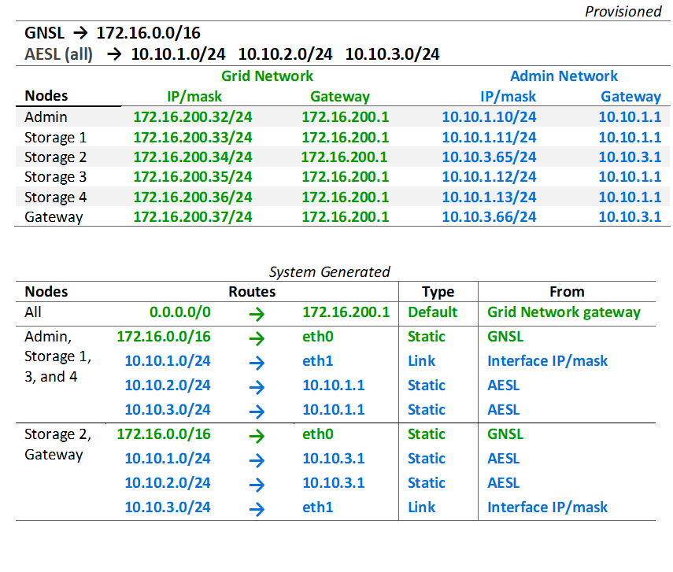

= 管理网络拓扑
:allow-uri-read: 
:icons: font
:imagesdir: ../media/

[role="lead"]
拥有管理网络是可选的。使用管理网络和网格网络的一种方法是为每个节点配置可路由的网格网络和有界的管理网络。

配置管理网络时，您将为每个网格节点的 eth1 接口建立主机 IP 地址、子网掩码和网关 IP 地址。

管理网络对于每个节点来说都是唯一的，并且可以由多个子网组成。每个节点都可以配置一个管理外部子网列表 (AESL)。  AESL 列出了每个节点可通过管理网络访问的子网。 AESL 还必须包括网格将通过管理网络访问的任何服务的子网，例如 NTP、DNS、KMS 和 LDAP。静态路由适用于 AESL 中的每个子网。

在此示例中，网格网络用于与 S3 客户端请求和对象管理相关的流量，而管理网络用于管理功能。

image::../media/grid_admin_networks.png[网格管理网络]

