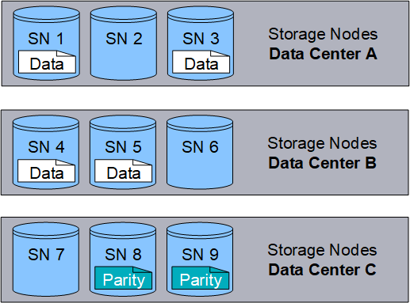

= 什么是对象
:allow-uri-read: 
:icons: font
:imagesdir: ../media/

[role="lead"]
对于对象存储，存储单位是一个对象，而不是一个文件或一个块。与文件系统或块存储的树状层次结构不同，对象存储以平面、非结构化的布局组织数据。

对象存储将数据的物理位置与用于存储和检索该数据的方法分离。

基于对象的存储系统中的每个对象都有两部分：对象数据和对象元数据。

image::../media/object_conceptual_drawing.png[对象]

== 什么是对象数据？

对象数据可以是任何东西；例如，照片、电影或医疗记录。

== 什么是对象元数据？

对象元数据是描述对象的任何信息。  StorageGRID使用对象元数据来跟踪网格中所有对象的位置并管理每个对象的生命周期。

对象元数据包括如下信息：

* 系统元数据，包括每个对象的唯一 ID（UUID）、对象名称、S3 存储桶或 Swift 容器的名称、租户帐户名称或 ID、对象的逻辑大小、对象首次创建的日期和时间以及对象最后修改的日期和时间。
* 每个对象副本或擦除编码片段的当前存储位置。
* 与对象关联的任何用户元数据。

对象元数据是可定制和可扩展的，使得应用程序可以灵活地使用。

有关StorageGRID如何以及在何处存储对象元数据的详细信息，请转至link:../admin/managing-object-metadata-storage.html["管理对象元数据存储"]。

== 对象数据如何受到保护？

StorageGRID系统为您提供了两种保护对象数据免于丢失的机制：复制和擦除编码。

=== 复制

当StorageGRID将对象与配置为创建复制副本的信息生命周期管理 (ILM) 规则匹配时，系统会创建对象数据的精确副本并将其存储在存储节点或云存储池上。 ILM 规则规定了副本的数量、副本的存储位置以及系统保留副本的时间。例如，如果由于存储节点丢失而导致副本丢失，则只要该对象的副本存在于StorageGRID系统中的其他地方，该对象仍然可用。

在以下示例中，“制作 2 个副本”规则指定将每个对象的两个副本放置在包含三个存储节点的存储池中。

image::../media/ilm_replication_make_2_copies.png[制定 2 份副本规则]

=== 纠删编码

当StorageGRID将对象与配置为创建擦除编码副本的 ILM 规则匹配时，它会将对象数据切分成数据片段，计算额外的奇偶校验片段，并将每个片段存储在不同的存储节点上。当访问一个对象时，它会使用存储的片段重新组装。如果数据或奇偶校验片段损坏或丢失，则擦除编码算法可以使用剩余数据和奇偶校验片段的子集重新创建该片段。  ILM 规则和擦除编码配置文件决定了所使用的擦除编码方案。

以下示例说明了如何在对象数据上使用擦除编码。在此示例中，ILM 规则使用 4+2 擦除编码方案。每个对象被切成四个相等的数据片段，并根据对象数据计算出两个奇偶校验片段。六个片段分别存储在三个数据中心的不同存储节点上，为节点故障或站点丢失提供数据保护。

.相关信息
* link:../ilm/index.html["使用 ILM 管理对象"]
* link:using-information-lifecycle-management.html["使用信息生命周期管理"]

