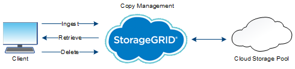

= 物体的寿命
:allow-uri-read: 
:icons: font
:imagesdir: ../media/

[role="lead"]
物体的生命由多个阶段组成。每个阶段代表与对象一起发生的操作。

对象的生命周期包括摄取、复制管理、检索和删除操作。

* *摄取*：S3 客户端应用程序通过 HTTP 将对象保存到StorageGRID系统的过程。在此阶段， StorageGRID系统开始管理对象。
* *复制管理*：管理StorageGRID中的复制和擦除编码副本的过程，如活动 ILM 策略中的 ILM 规则所述。在复制管理阶段， StorageGRID通过在存储节点或云存储池中创建和维护指定数量和类型的对象副本来保护对象数据免于丢失。
* *检索*：客户端应用程序访问StorageGRID系统存储的对象的过程。客户端读取从存储节点或云存储池检索的对象。
* *删除*：从网格中删除所有对象副本的过程。对象可以通过客户端应用程序向StorageGRID系统发送删除请求来删除，也可以通过对象生命周期到期时StorageGRID执行的自动过程来删除。

.相关信息
* link:../ilm/index.html["使用 ILM 管理对象"]
* link:using-information-lifecycle-management.html["使用信息生命周期管理"]

