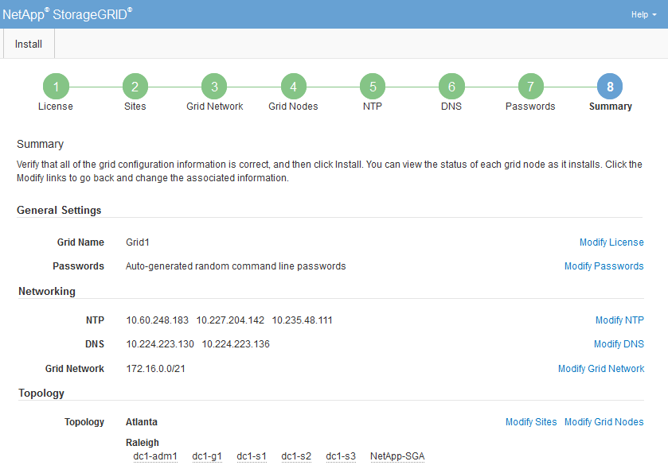

= 检查您的配置并完成安装
:allow-uri-read: 
:icons: font
:imagesdir: ../media/

[role="lead"]
您必须仔细检查输入的配置信息，以确保安装成功完成。

.步骤
. 查看*摘要*页面。
+

. 验证所有电网配置信息是否正确。使用摘要页面上的修改链接返回并更正任何错误。
. 单击“*安装*”。
+

NOTE: 如果节点配置为使用客户端网络，则当您单击*安装*时，该节点的默认网关将从网格网络切换到客户端网络。如果失去连接，您必须确保通过可访问的子网访问主管理节点。看link:../network/index.html["网络指南"]了解详情。

. 单击“下载恢复包”。
+
当安装进行到定义网格拓扑的阶段时，系统会提示您下载恢复包文件(`.zip`)，并确认您可以成功访问此文件的内容。您必须下载恢复包文件，以便在一个或多个网格节点发生故障时恢复StorageGRID系统。安装在后台继续，但在下载并验证此文件之前，您无法完成安装并访问StorageGRID系统。

. 验证您是否可以提取 `.zip`文件，然后将其保存在两个安全、可靠且独立的位置。
+

CAUTION: 恢复包文件必须是安全的，因为它包含可用于从StorageGRID系统获取数据的加密密钥和密码。

. 选中*我已成功下载并验证了恢复包文件*复选框，然后单击*下一步*。
+
如果安装仍在进行中，则会出现状态页面。此页面显示每个网格节点的安装进度。

+
image::../media/12_gmi_installer_status_page.gif[本图四周的文字提供了相关说明。]

+
当所有网格节点都达到完成阶段时，将出现网格管理员的登录页面。

. 使用“root”用户和安装期间指定的密码Sign in网格管理器。

