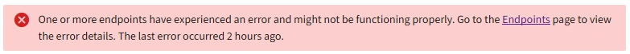

= 了解租户管理器仪表板
:allow-uri-read: 
:icons: font
:imagesdir: ../media/

[role="lead"]
租户管理器仪表板概述了租户帐户的配置以及租户存储桶（S3）或容器（Swift）中的对象使用的空间量。如果租户有配额，仪表板会显示已使用的配额量以及剩余的配额量。如果存在与租户帐户相关的任何错误，则错误将显示在仪表板上。

NOTE: 已用空间值是估计值。这些估计受到摄取时间、网络连接和节点状态的影响。

对象上传后，仪表板如下例所示：

image::../media/tenant_dashboard_with_buckets.png[仪表板 - 愿望清单]

== 租户账户信息

仪表板顶部显示已配置的存储桶或容器、组和用户的数量。如果已配置，它还会显示平台服务端点的数量。选择链接来查看详细信息。

取决于link:tenant-management-permissions.html["租户管理权限"]您拥有的和您配置的选项，仪表板的其余部分显示指南、存储使用情况、对象信息和租户详细信息的各种组合。

== 存储和配额使用情况

存储使用情况面板包含以下信息：

* 租户的对象数据量。
+
该值表示上传的对象数据总量，并不代表用于存储这些对象及其元数据的副本的空间。

* 如果设置了配额，则表示对象数据可用的空间总量以及剩余空间量和百分比。配额限制了可以摄取的对象数据量。
+

CAUTION: 配额使用基于内部估计，在某些情况下可能会超出。例如，当租户开始上传对象时， StorageGRID会检查配额，如果租户超出配额，则会拒绝新的摄取。但是， StorageGRID在确定是否超出配额时不会考虑当前上传的大小。如果对象被删除，租户可能会暂时无法上传新对象，直到重新计算配额使用情况。配额使用情况计算可能需要 10 分钟或更长时间。

* 表示最大桶或容器的相对大小的条形图。
+
您可以将光标放在任何图表段上，以查看该存储桶或容器消耗的总空间。

+
image::../media/tenant_dashboard_storage_usage_segment.png[条形图片段]

* 与条形图相对应，最大的存储桶或容器的列表，包括对象数据的总量和每个存储桶或容器的对象数量。
+
image::../media/tenant_dashboard_buckets.png[租户仪表板存储桶]

+
如果租户有超过九个存储桶或容器，则所有其他存储桶或容器将合并为列表底部的单个条目。

NOTE: 要更改租户管理器中显示的存储值的单位，请选择租户管理器右上角的用户下拉菜单，然后选择*用户首选项*。

== 配额使用警报

如果在网格管理器中启用了配额使用警报，则当配额较低或超出时，这些警报将显示在租户管理器中，如下所示：

* 如果已使用租户配额的 90% 或更多，则会触发“租户配额使用率高”警报。
+
考虑要求您的电网管理员增加配额。

* 如果超出配额，则会收到通知，告知您无法上传新对象。

== [[bucket-capacity-usage]]容量限制使用情况

如果您为存储桶设置了容量限制，租户管理器仪表板将显示按容量限制使用情况排列的顶级存储桶列表。

如果未设置 bucket 的限制，则其容量是无限的。但是，如果您的租户帐户具有总存储配额并且已达到该配额，则无论存储桶的剩余容量限制如何，您都将无法提取更多对象。

== 端点错误

如果您已使用网格管理器配置一个或多个端点以用于平台服务，则如果过去七天内发生任何端点错误，租户管理器仪表板将显示警报。

查看有关link:troubleshooting-platform-services-endpoint-errors.html["平台服务端点错误"]，选择 *Endpoints* 以显示 Endpoints 页面。
