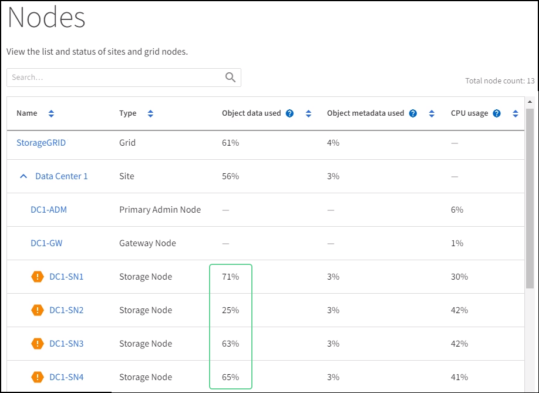

= 解决低只读水印覆盖警报问题
:allow-uri-read: 
:icons: font
:imagesdir: ../media/

[role="lead"]
如果您对存储卷水印使用自定义值，则可能需要解决*低只读水印覆盖*警报。如果可能的话，您应该更新您的系统以开始使用优化值。

在之前的版本中，这三个link:../admin/what-storage-volume-watermarks-are.html["存储卷水印"]是全局设置 — — 相同的值应用于每个存储节点上的每个存储卷。从StorageGRID 11.6 开始，该软件可以根据存储节点的大小和卷的相对容量优化每个存储卷的这些水印。

升级到StorageGRID 11.6 或更高版本时，优化的只读和读写水印将自动应用于所有存储卷，除非以下任一情况为真：

* 您的系统已接近容量上限，如果应用优化水印，将无法接受新数据。在这种情况下， StorageGRID不会更改水印设置。
* 您之前将任何存储卷水印设置为自定义值。 StorageGRID不会用优化值覆盖自定义水印设置。但是，如果存储卷软只读水印的自定义值太小， StorageGRID可能会触发*低只读水印覆盖*警报。

== 了解警报

如果您对存储卷水印使用自定义值，则可能会针对一个或多个存储节点触发*低只读水印覆盖*警报。

警报的每个实例都表明存储卷软只读水印的自定义值小于该存储节点的最小优化值。如果继续使用自定义设置，存储节点可能会在安全转换为只读状态之前出现空间严重不足的情况。当节点达到容量时，某些存储卷可能会变得无法访问（自动卸载）。

例如，假设您之前将存储卷软只读水印设置为 5 GB。现在假设StorageGRID已为存储节点 A 中的四个存储卷计算了以下优化值：

[cols="2a,2a"]
|===

 a| 
卷 0
 a| 
12 GB

 a| 
卷 1
 a| 
12 GB

 a| 
卷 2
 a| 
11 GB

 a| 
卷 3
 a| 
15 GB

|===
存储节点 A 触发了 *低只读水印覆盖* 警报，因为您的自定义水印（5 GB）小于该节点中所有卷的最小优化值（11 GB）。如果继续使用自定义设置，节点可能会在安全转换到只读状态之前出现空间严重不足的情况。

== 解决警报

如果触发了一个或多个*低只读水印覆盖*警报，请按照以下步骤操作。如果您当前使用自定义水印设置，并且即使没有触发警报也想开始使用优化设置，您也可以使用这些说明。

.开始之前
* 您已完成升级到StorageGRID 11.6 或更高版本。
* 您已使用link:../admin/web-browser-requirements.html["支持的网络浏览器"]。
* 你有link:../admin/admin-group-permissions.html["Root访问权限"]。

.关于此任务
您可以通过将自定义水印设置更新为新的水印覆盖来解决*低只读水印覆盖*警报。但是，如果一个或多个存储节点接近满，或者您有特殊的 ILM 要求，则应首先查看优化的存储水印并确定使用它们是否可以安全。

=== 评估整个电网的对象数据使用情况

.步骤
. 选择*NODES*。
. 对于网格中的每个站点，展开节点列表。
. 查看每个站点的每个存储节点的*使用的对象数据*列中显示的百分比值。
+

. 按照适当的步骤操作：
+
.. 如果没有一个存储节点接近满（例如，所有*使用的对象数据*值都小于 80%），则可以开始使用覆盖设置。前往<<use-optimized-watermarks,使用优化水印>>。
.. 如果 ILM 规则使用严格接收行为，或者特定存储池接近满，请执行<<view-optimized-watermarks,查看优化的存储水印>>和<<determine-optimized-watermarks,确定是否可以使用优化水印>>。

=== [[view-optimized-watermarks]]查看优化的存储水印

StorageGRID使用两个 Prometheus 指标来显示它为存储卷软只读水印计算的优化值。您可以查看网格中每个存储节点的最小和最大优化值。

.步骤
. 选择*支持* > *工具* > *指标*。
. 在 Prometheus 部分中，选择链接以访问 Prometheus 用户界面。
. 要查看建议的最小软只读水印，请输入以下 Prometheus 指标，然后选择 *执行*：
+
`storagegrid_storage_volume_minimum_optimized_soft_readonly_watermark`

+
最后一列显示每个存储节点上所有存储卷的软只读水印的最小优化值。如果该值大于存储卷软只读水印的自定义设置，则会触发存储节点的*低只读水印覆盖*警报。

. 要查看建议的最大软只读水印，请输入以下 Prometheus 指标，然后选择 *执行*：
+
`storagegrid_storage_volume_maximum_optimized_soft_readonly_watermark`

+
最后一列显示每个存储节点上所有存储卷的软只读水印的最大优化值。

. [[maximum_optimized_value]]注意每个存储节点的最大优化值。

=== [[determine-optimized-watermarks]]确定是否可以使用优化水印

.步骤
. 选择*NODES*。
. 对每个在线存储节点重复这些步骤：
+
.. 选择 *_Storage Node_* > *Storage*。
.. 向下滚动到对象存储表。
.. 将每个对象存储（卷）的*可用*值与您为该存储节点记录的最大优化水印进行比较。

. 如果每个在线存储节点上至少有一个卷的可用空间大于该节点的最大优化水印，则转到<<use-optimized-watermarks,使用优化水印>>开始使用优化的水印。
+
否则，尽快扩大电网。任何一个link:../expand/adding-storage-volumes-to-storage-nodes.html["添加存储卷"]到现有节点或link:../expand/adding-grid-nodes-to-existing-site-or-adding-new-site.html["添加新的存储节点"]。然后，转到<<use-optimized-watermarks,使用优化水印>>更新水印设置。

. 如果您需要继续使用自定义值作为存储卷水印，link:../monitor/silencing-alert-notifications.html["沉默"]或者link:../monitor/disabling-alert-rules.html["禁用"]*低只读水印覆盖*警报。
+

NOTE: 相同的自定义水印值适用于每个存储节点上的每个存储卷。如果存储卷水印使用小于建议的值，则可能会导致某些存储卷在节点达到容量时变得无法访问（自动卸载）。

=== [[use-optimized-watermarks]]使用优化水印

.步骤
. 转到*支持* > *其他* > *存储水印*。
. 选中“使用优化值”复选框。
. 选择*保存*。

根据存储节点的大小和卷的相对容量，优化的存储卷水印设置现在对每个存储卷生效。
